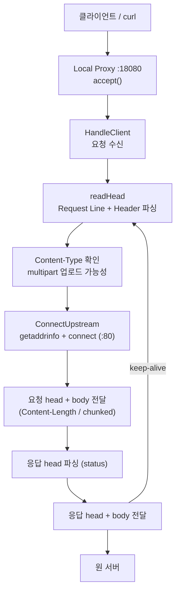

# Local Proxy 기반 네트워크 트래픽 분석 PoC 보고서 (격식 버전)

## 1. 개요

본 문서는 Windows 환경에서 클라이언트(브라우저, curl 등)의 HTTP 통신을 Local Proxy로 받아 원 서버로 중계하고, 그 과정에서 HTTP 메시지를 파싱하여 통신 내용을 식별하는 구조를 정리한 기술 문서이다. 본 단계는 전체 연구과제(WFP driver + Local Proxy + TLS MITM 기반 통신 분석)에서 Local Proxy의 HTTP 처리 기반에 해당한다.

본 보고서는 네트워크 지식을 전제하지 않고, 통신이 실제로 어떤 계층을 거쳐 이루어지는지부터 설명한 뒤 구현 구조와 실측 결과를 제시한다. HTTPS 복호화(TLS MITM)는 본 단계 범위에 포함하지 않으며 후속 단계에서 다룬다.

본 구조의 핵심은 다음과 같다.

| 구분 | 설명 |
|------|------|
| 서버 계층 | Local Proxy가 loopback port(127.0.0.1:18080)에서 클라이언트 연결을 수락하고, 연결마다 독립적으로 처리한다. |
| 목적지 연결 | 요청에서 추출한 host를 IP로 변환하여 원 서버(upstream)에 별도 TCP 연결을 만든다. |
| HTTP 처리 | HTTP 요청/응답을 파싱하여 Method, URL, Header, Content-Type, body 경계를 식별하고 정확히 중계한다. |
| 업로드 식별 | Content-Type이 multipart/form-data인 요청을 파일 업로드 가능성이 있는 요청으로 1차 분류한다. |
| 범위 | HTTP/1.1 평문 통신을 대상으로 하며, HTTPS 내용 분석은 후속 단계(TLS MITM)에서 다룬다. |

## 2. 연구 배경 및 목적

웹 브라우저, 업무용 애플리케이션, AI Agent 등 다양한 클라이언트가 외부 서비스로 파일과 데이터를 전송하는 사례가 증가하고 있다. 이러한 환경에서는 조직 보안 정책상 허용되지 않은 파일 업로드가 발생할 수 있으며, 이를 네트워크 수준에서 식별·분석할 수 있는 구조가 필요하다.

네트워크 통신은 클라이언트가 서버로 데이터를 보내는 단순한 과정처럼 보이지만, 실제로는 여러 통신 계층을 거쳐 처리된다. 본 연구에서는 클라이언트와 서버 사이에 Local Proxy를 배치하여 트래픽을 중계하고, 그 과정에서 HTTP Method, Host, Header, Content-Type, body 존재 여부 등을 분석한다.

본 과제는 PoC(Proof of Concept) 성격의 연구이다. PoC는 특정 기술 구조가 실제로 가능한지 검증하기 위한 실험적 구현을 의미하며, 상용 제품 수준의 완전한 보안 기능 구현이 아니라 Local Proxy 기반 분석 구조가 실제로 동작 가능한지 확인하는 데 초점을 둔다.

## 3. 목표

### 3.1 기능 목표

| 목표 | 현재 상태 | 설명 |
|------|-----------|------|
| 연결 수락 및 동시 처리 | 구현 | loopback port에서 listen하고, 연결마다 독립 스레드로 처리한다. |
| 목적지 식별 및 upstream 연결 | 구현 | 요청 host를 `getaddrinfo`로 IP 변환 후 원 서버에 TCP 연결한다. |
| HTTP 요청/응답 파싱 | 구현 | 시작줄(Method/URL/Version)과 Header를 파싱하여 메시지를 식별한다. |
| body 경계 판정 | 구현 | Content-Length 및 chunked 전송을 판정하여 body를 정확히 중계한다. |
| keep-alive 처리 | 구현 | 하나의 연결에서 여러 요청을 연속 처리한다. |
| 파일 업로드 가능성 탐지 | 구현 | Content-Type이 multipart/form-data인 요청을 1차 분류한다. |
| 파일명/바이너리 추출 | 미적용 | Content-Disposition, boundary 파싱, 파일 데이터 추출은 후속 단계 범위이다. |
| HTTPS 내용 분석(TLS MITM) | 미적용 | 본 단계는 평문 HTTP를 대상으로 하며, HTTPS 복호화는 후속 단계 범위이다. |

### 3.2 검토 목표

- 현재 식별 가능한 통신 내용과 불가능한 내용을 구분한다.
- 구현 완료 항목과 향후 보완 항목을 분리한다.
- 실제 코드(`proxy_arch.cpp`)와 실측 결과를 기준으로 문서화한다.

---

## 4. 기본 개념 설명

### 4.1 OSI 7계층

OSI 7계층은 네트워크 통신 과정을 7개의 계층으로 나누어 설명하는 개념 모델이다. 송신 측에서는 데이터가 상위 계층에서 하위 계층으로 내려가며 전송 가능한 형태로 변환되고, 수신 측에서는 하위 계층에서 상위 계층으로 올라가며 원래 데이터로 복원된다.

| 계층 | 이름 | 주요 역할 | 예시 |
|------|------|-----------|------|
| 7 | Application | 응용 서비스 | HTTP, HTTPS, FTP |
| 6 | Presentation | 데이터 표현, 인코딩, 암호화 | 인코딩, 압축, TLS |
| 5 | Session | 통신 세션 관리 | 연결 관리 |
| 4 | Transport | 프로세스 간 데이터 전송 | TCP, UDP |
| 3 | Network | 목적지 경로 결정 | IP |
| 2 | Data Link | 같은 네트워크 구간 전달 | Ethernet, MAC |
| 1 | Physical | 물리 신호 전송 | 케이블, Wi-Fi |

본 프로젝트에서 Local Proxy가 다루는 핵심 계층은 두 곳이다. 데이터를 바이트 단위로 운반하는 것은 4계층(TCP)이고, 그 바이트를 Method/URL/Header/body로 해석하는 것은 7계층(HTTP)이다. 프록시가 바이트만 통과시키면 4계층 수준의 중계이며, HTTP를 파싱하면 7계층 수준의 식별이 가능해진다.

### 4.2 클라이언트-서버 통신 흐름

사용자가 브라우저에서 `http://example.com`에 접속하는 경우의 흐름은 다음과 같다.

1. 브라우저가 HTTP 요청을 생성한다.
2. 클라이언트가 서버와 TCP 연결을 수립한다.
3. HTTP 요청이 TCP/IP 계층을 거쳐 서버로 전송된다.
4. 서버가 요청을 해석·처리하고 HTTP 응답을 생성한다.
5. 응답이 다시 TCP/IP 계층을 거쳐 클라이언트로 전달된다.
6. 브라우저가 응답을 해석하여 화면에 표시한다.

요청은 송신 측 7계층에서 생성되어 1계층까지 내려간 뒤 네트워크로 전달되고, 서버에서는 1계층에서 7계층으로 올라가며 해석된다. 응답도 같은 방식으로 처리된다.

### 4.3 TCP/IP와 소켓

TCP는 연결 지향형 전송 프로토콜이다. 데이터를 주고받기 전에 연결을 먼저 수립하며, 이후 신뢰성 있는 송수신을 수행한다. 소켓은 이 통신을 수행하기 위한 프로그래밍 인터페이스이다.

서버 측 소켓 흐름:

```
socket()    통신용 소켓 생성
bind()      소켓에 IP/port 연결
listen()    연결 요청 대기 상태로 전환
accept()    클라이언트 연결 수락
recv()      데이터 수신
send()      데이터 전송
closesocket()  소켓 종료
```

클라이언트 측 소켓 흐름:

```
socket()    소켓 생성
connect()   서버에 연결 요청
send()      데이터 전송
recv()      응답 수신
closesocket()  소켓 종료
```

Windows에서는 Winsock API를 사용하므로, 소켓 사용 전 `WSAStartup`을 호출해 라이브러리를 초기화해야 한다. Local Proxy는 클라이언트를 받는 서버 역할과 원 서버로 연결하는 클라이언트 역할을 동시에 수행하므로, 위 두 흐름을 모두 사용한다.

### 4.4 HTTP 요청/응답 구조

HTTP는 요청/응답 기반의 평문 프로토콜이다. 메시지는 다음 구조를 가진다.

HTTP 요청:

| 구성 요소 | 설명 |
|-----------|------|
| Request Line | 첫 줄. Method, Path(또는 URL), HTTP Version |
| Header | 부가 정보. Host, Content-Type, Content-Length 등 |
| Body | 전송 데이터. GET은 보통 없음, POST는 포함될 수 있음 |

HTTP 응답:

| 구성 요소 | 설명 |
|-----------|------|
| Status Line | 첫 줄. HTTP Version, Status Code, Reason Phrase |
| Header | 부가 정보. Content-Type, Content-Length, Server 등 |
| Body | 응답 데이터. HTML, JSON, 파일 데이터 등 |

Header와 Body는 빈 줄(CRLF)로 구분된다. 그중 Content-Type은 body의 형식을 나타내는 Header이며, `multipart/form-data`인 경우 파일 업로드 요청일 가능성이 있다.

### 4.5 Proxy와 Local Proxy

Proxy는 클라이언트와 서버 사이에서 요청과 응답을 중계하는 중간 구성 요소이다. 일반 통신에서는 클라이언트가 서버에 직접 연결하지만, Proxy 구조에서는 클라이언트가 Proxy로 요청을 보내고 Proxy가 원 서버로 전달한다. Proxy는 클라이언트 입장에서는 서버처럼, 서버 입장에서는 클라이언트처럼 동작한다.

Local Proxy는 사용자 PC 내부(127.0.0.1)에서 실행되는 Proxy이다. 클라이언트 요청을 중간에서 확인할 수 있으므로 Method, Host, Header, Content-Type 등을 분석할 수 있다.

### 4.6 Explicit Proxy와 Transparent Proxy

| 구분 | Explicit Proxy | Transparent Proxy |
|------|----------------|-------------------|
| 클라이언트 인지 | Proxy 사용을 명시적으로 인지 | 인지하지 못함 |
| 설정 방식 | 클라이언트가 Proxy 주소 직접 설정 | OS/네트워크 계층에서 리다이렉션 |
| 구현 난이도 | 낮음 | 높음 |
| 목적지 정보 | 요청(Host 등)에서 확인 | 리다이렉션 Context로 복원 필요 |
| 본 PoC 적용 | 현재 방식 | 향후 확장(WFP) |

본 단계는 구현·테스트 편의성을 위해 Explicit Proxy 방식을 사용한다. 즉 curl이나 브라우저가 Proxy 주소(127.0.0.1:18080)를 직접 지정하여 요청을 보낸다. Transparent Proxy는 Windows WFP 기반 리다이렉션과 목적지 복원이 필요하므로 후속 확장 범위로 분리한다.

### 4.7 TCP 스트림과 버퍼링

TCP는 메시지 단위가 아니라 바이트 스트림이다. 따라서 `recv` 한 번이 HTTP 메시지 하나와 정확히 일치하지 않는다.

- 부분 수신: 헤더가 끝나기 전에 `recv`가 일부만 반환할 수 있다.
- 과다 수신(over-read): 헤더 이후의 body, 또는 다음 요청의 일부까지 한 번에 읽힐 수 있다.

이를 처리하기 위해 본 구현은 소켓 위에 버퍼드 리더(`SockReader`)를 둔다. 이 리더는 줄 단위 읽기, N바이트 정확히 읽기, 정확한 길이만큼 전달, 잉여 바이트 보관을 제공하여 메시지 경계를 정확히 식별한다.

### 4.8 body 프레이밍

HTTP는 body 길이를 두 가지 방식으로 알린다. body가 어디서 끝나는지를 알아야 keep-alive와 정확한 body 추출이 가능하다.

| 방식 | 판단 Header | 처리 |
|------|-------------|------|
| Content-Length | `Content-Length: N` | 정확히 N바이트가 body |
| chunked | `Transfer-Encoding: chunked` | 청크 크기(16진수)별로 끊어 읽음 |
| 없음 | (둘 다 없음) | 응답은 연결 종료까지, 요청은 body 없음 |

---

## 5. 전체 구조

본 구현(`proxy_arch.cpp`)은 단일 사용자 모드 프로세스로 동작한다. 연결 하나가 들어오면 첫 요청의 메서드에 따라 평문 HTTP 처리로 진입한다. (CONNECT 요청은 HTTPS 터널로 통과시키며, 내용 분석은 후속 단계 범위이다.)

### 5.1 전체 흐름도



**텍스트 설명:**

1. 클라이언트가 프록시 loopback port(127.0.0.1:18080)로 연결한다.
2. 프록시가 `accept()`로 연결을 수락하고, 연결마다 독립 스레드에서 처리한다.
3. 요청 head(Request Line + Header)를 파싱한다.
4. Content-Type을 확인하여 multipart/form-data 여부(업로드 가능성)를 판정한다.
5. host를 추출하여 원 서버(:80)에 연결한다.
6. 요청 head와 body를 길이 판정에 맞춰 전달한다.
7. 응답 head를 파싱하고 응답 head/body를 클라이언트로 전달한다.
8. keep-alive면 같은 연결에서 다음 요청을 이어 처리한다.

### 5.2 코드 구성

| 구성 요소 | 역할 |
|-----------|------|
| `RunServer` | listen 소켓 생성, accept 루프, 연결마다 스레드 분리 |
| `HandleClient` | 요청 수신 및 처리 진입 |
| `HandleHttp` | HTTP 파싱 루프 (요청·응답 처리, multipart 판별, keep-alive) |
| `SockReader` | TCP 스트림 버퍼드 리더 (줄/N바이트 읽기, body 스트리밍, 잉여 보관) |
| `readHead` / `HttpHead` | Request Line + Header 파싱 및 보관 |
| `BodyMode` 판정 | Content-Length / chunked / 없음 구분 |
| `ConnectUpstream` | `getaddrinfo` + `connect`로 원 서버 연결 |
| `sendAll` | 부분 전송 대비 전량 송신 보장 |

### 5.3 Proxy 내부 소켓 구조

Local Proxy는 두 종류의 소켓을 사용한다.

| 소켓 | 역할 |
|------|------|
| client socket | 클라이언트와 연결된 소켓. 요청 수신, 응답 송신 |
| upstream socket | 원 서버와 연결된 소켓. 요청 송신, 응답 수신 |

이 구조에서 Local Proxy는 클라이언트 입장에서는 서버로, 원 서버 입장에서는 클라이언트로 동작한다.

---

## 6. 현재 구현된 결과

| 영역 | 구현 내용 | 실제 의미 |
|------|-----------|-----------|
| 서버 수립 | `WSAStartup`/`socket`/`bind`/`listen`/`accept` + 연결당 스레드 | 다수 클라이언트 연결을 동시에 수락·처리한다. |
| 목적지 연결 | `getaddrinfo`/`socket`/`connect` 기반 upstream 연결 | 요청 host를 IP로 변환하여 실제 원 서버에 연결한다. |
| HTTP 파싱 | Request Line·Header 파싱(`readHead`) | Method, URL, Status, Header를 식별한다. |
| body 프레이밍 | Content-Length 및 chunked 판정·중계 | body 경계를 알고 손실 없이 전달한다. |
| 업로드 가능성 탐지 | Content-Type의 multipart/form-data 판별 | 파일 업로드 의심 요청을 1차 분류한다. |
| keep-alive | 단일 연결 내 요청 반복 처리 | 하나의 연결에서 여러 요청을 연속 처리한다. |

---

## 7. 처리 방식

### 7.1 HTTP 파싱 루프

평문 HTTP 요청은 `HandleHttp`의 파싱 루프에서 처리된다.

```
반복 {
  1. 요청 head 파싱 (Request Line + Header)
  2. Content-Type 확인 (multipart/form-data 업로드 가능성)
  3. host 추출 후 upstream 연결
  4. 요청 head + body 전달 (Content-Length / chunked)
  5. 응답 head 파싱 (status)
  6. 응답 head + body 전달
  7. keep-alive면 반복, 아니면 종료
}
```

### 7.2 파일 업로드 가능성 판별

요청 head를 파싱한 직후 Content-Type Header를 확인한다. 값에 `multipart/form-data`가 포함되면 파일 업로드 가능성이 있는 요청으로 분류하여 로그에 표시한다. 본 단계는 파일명이나 파일 데이터를 추출하지 않으며, 추출은 후속 단계 범위이다.

### 7.3 요청/응답 처리 단계

요청 처리는 원 서버로 데이터를 보내기 전에 수행되며, 응답 처리는 서버 응답을 받아 클라이언트로 전달하기 전에 수행된다. 두 단계 모두 head를 파싱하여 메시지를 식별하고, body 길이 판정에 맞춰 정확히 중계한다.

---

## 8. 테스트 및 검증

### 8.1 테스트 환경

- 프록시: `proxy_arch.exe` 가 `127.0.0.1:18080` 에서 실행
- 클라이언트: curl (Explicit Proxy 방식, `-x` 옵션으로 프록시 지정)
- 대상 서버: `postman-echo.com` (요청을 그대로 echo하는 테스트 서버)

아래 로그는 실제로 실행하여 프록시 콘솔에 출력된 결과이다.

```
[proxy_arch] :18080  (HTTP + HTTPS tunnel)
[http] GET    http://postman-echo.com/get -> 200
[http] POST   http://postman-echo.com/post -> 200
[http] POST   http://postman-echo.com/post -> 200  [upload? multipart/form-data]
```

### 8.2 GET 요청 분석

```
curl -x http://127.0.0.1:18080 http://postman-echo.com/get
```

| 항목 | 실측 값 |
|------|---------|
| Method | GET |
| URL | http://postman-echo.com/get |
| Status | 200 |
| 업로드 의심 | 없음 |

### 8.3 POST(JSON) 요청 분석

```
curl -x http://127.0.0.1:18080 -X POST -H "Content-Type: application/json" -d "{\"name\":\"test\"}" http://postman-echo.com/post
```

| 항목 | 실측 값 |
|------|---------|
| Method | POST |
| URL | http://postman-echo.com/post |
| Content-Type | application/json |
| Status | 200 |
| 업로드 의심 | 없음 |

### 8.4 파일 업로드(multipart) 요청 분석

```
curl -x http://127.0.0.1:18080 -F "file=@test.txt" http://postman-echo.com/post
```

| 항목 | 실측 값 |
|------|---------|
| Method | POST |
| URL | http://postman-echo.com/post |
| Content-Type | multipart/form-data |
| Status | 200 |
| 업로드 의심 | 탐지됨 (`[upload? multipart/form-data]`) |

세 요청 모두 프록시를 정상 경유하여 200 응답을 받았으며, multipart 요청은 업로드 가능성 요청으로 정확히 분류되었다. 이는 mock 데이터가 아니라 실제 실행 로그이다.

---

## 9. 처리 범위와 제약사항

### 9.1 HTTP/1.1 평문 중심

본 단계는 HTTP/1.1 평문 통신을 대상으로 한다. HTTP/2의 바이너리 multiplexing 프레이밍은 별도 파서가 필요하다.

### 9.2 I/O 동시성 모델

본 구현은 blocking 소켓 + 연결당 스레드 1개 모델을 사용한다. 흐름을 단순하게 따라갈 수 있으나, 연결 수가 많아지면 스레드 수가 비례 증가하고 context switch 비용이 커진다. 실제 고성능 프록시는 non-blocking 소켓과 이벤트 루프(epoll/IOCP)를 사용하여 소수 스레드로 다수 연결을 처리한다.

### 9.3 파일 데이터 추출 미적용

현재는 Content-Type 기반으로 업로드 가능성만 판별한다. 파일명(Content-Disposition), MIME Type, boundary 파싱, 파일 바이너리 추출은 후속 단계 범위이다.

### 9.4 HTTPS 내용 분석은 후속 단계 범위

HTTPS는 TLS 암호화로 인해 단순 TCP/HTTP Proxy 구조만으로는 내용을 확인할 수 없다. URL, Header, body 수준의 HTTPS 분석은 TLS MITM이 적용되는 후속 단계에서 가능하며, Root CA 신뢰와 host별 인증서 생성 등 별도 요소를 필요로 한다.

### 9.5 Transparent Proxy 미구현

현재는 Explicit Proxy 기반이다. Transparent Proxy 구조는 Windows WFP 기반 리다이렉션과 목적지 복원이 필요하므로 후속 확장 범위로 분리한다.

---

## 10. 결론

본 단계 구현은 Local Proxy가 클라이언트의 HTTP 통신을 수락하여 원 서버로 중계하고, 메시지를 7계층 수준에서 파싱하여 Method/URL/Header/Content-Type/body를 식별할 수 있는 구조를 검증하였다. 특히 `SockReader`와 body 프레이밍 판정을 통해 메시지 경계를 정확히 식별하며, Content-Type 기반으로 파일 업로드 가능성을 1차 분류한다. 이 모든 동작은 실제 실행 로그로 검증되었다.

이 구조는 통신 내용의 정확한 식별과 업로드 가능성 판별을 가능하게 하여, 향후 파일명·바이너리 추출과 정책 기반 제어로 확장되는 기반을 제공한다. HTTPS 내용 분석, 파일 데이터 추출, Transparent Proxy(WFP)는 후속 단계에서 단계적으로 확장한다.

---

## 부록 A. 주요 용어

| 용어 | 설명 |
|------|------|
| OSI 7계층 | 네트워크 통신을 7개 계층으로 나누어 설명하는 모델 |
| PoC | Proof of Concept. 기술 구조가 실제로 가능한지 검증하는 실험적 구현 |
| TCP | 연결 지향형 전송 프로토콜 |
| Socket | 네트워크 통신을 위한 프로그래밍 인터페이스 |
| Winsock | Windows의 소켓 프로그래밍 API |
| Proxy | 클라이언트와 서버 사이에서 요청/응답을 중계하는 구성 요소 |
| Local Proxy | 사용자 PC 내부(127.0.0.1)에서 실행되는 Proxy |
| Explicit Proxy | 클라이언트가 Proxy 주소를 명시적으로 설정하는 방식 |
| Transparent Proxy | 클라이언트가 인지하지 못한 채 요청이 Proxy로 전달되는 방식 |
| Request Line | HTTP 요청 첫 줄. Method, Path, Version |
| Content-Type | body 데이터 형식을 나타내는 Header |
| multipart/form-data | 파일 업로드 시 자주 사용되는 HTTP body 형식 |
| keep-alive | 하나의 연결에서 여러 요청을 연속 처리하는 방식 |
