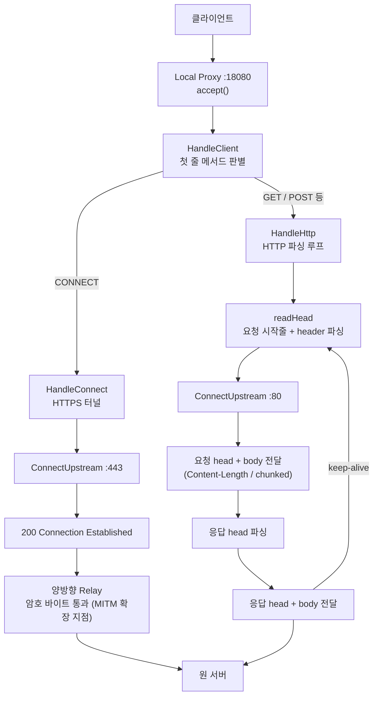

# Local Proxy 기반 HTTP/HTTPS 통신 중계 구조 연구

## 1. 개요

본 문서는 Windows 환경에서 클라이언트(브라우저 등)의 HTTP/HTTPS 통신을 Local Proxy로 받아 원 서버로 중계하고, 그 과정에서 HTTP 메시지를 파싱하여 통신 내용을 식별하는 구조를 정리한 기술 문서이다. 본 단계는 전체 연구과제(WFP driver + Local Proxy + TLS MITM 기반 통신 분석)에서 Local Proxy의 HTTP 처리 기반에 해당하며, TLS MITM(HTTPS 복호화) 이전까지의 구조와 구현 결과, 처리 방식, 처리 가능 범위와 제약사항을 함께 설명한다.

본 구조의 핵심은 다음과 같다.

| 구분 | 설명 |
|------|------|
| 서버 계층 | Local Proxy가 loopback port에서 클라이언트 연결을 수락하고, 연결마다 독립적으로 처리한다. |
| 목적지 연결 | 요청에서 추출한 host를 IP로 변환하여 원 서버(upstream)에 별도 TCP 연결을 만든다. |
| HTTP 처리 | 평문 HTTP 요청/응답을 파싱하여 method, URL, header, body 경계를 식별하고 정확히 중계한다. |
| HTTPS 처리 | CONNECT 요청에 대해 TCP 터널을 열고, 암호화된 바이트를 그대로 통과시킨다(blind tunnel). |
| 확장 지점 | CONNECT 터널이 열리는 지점이 향후 TLS MITM(HTTPS 복호화)이 끼어드는 위치이다. |

## 2. 연구/개발 배경

네트워크 통신을 중계하는 프록시는 그 중간에서 무엇을 해석하느냐에 따라 처리 수준이 나뉜다. 단순히 바이트를 양쪽으로 흘려보내는 중계는 전송 계층(L4) 수준이며, 통신의 내용(method, URL, header, body)을 알 수 없다. 반면 HTTP 메시지를 파싱하여 메시지 경계와 의미를 해석하면 응용 계층(L7) 수준의 식별과 제어가 가능해진다.

본 연구의 최종 목표인 파일 업로드 식별과 정책 기반 제어를 수행하려면, 프록시가 통신 내용을 L7 수준에서 정확히 해석할 수 있어야 한다. 이를 위해서는 다음이 전제된다.

1. 클라이언트 연결을 Local Proxy가 수락한다.
2. 요청에서 원래 목적지(host)를 식별하고 원 서버로 연결한다.
3. 평문 HTTP는 요청/응답을 파싱하여 메시지 경계를 식별한다.
4. body 길이를 정확히 판정하여 body를 손실 없이 중계·추출한다.
5. HTTPS는 우선 CONNECT 터널로 처리하고, 이후 단계에서 TLS MITM으로 복호화한다.

이 구조는 HTTP 파싱 기반의 정확한 메시지 처리와, HTTPS 터널 처리를 함께 다룬다는 점에서 이후 TLS MITM 단계로 자연스럽게 확장된다. 반면 대규모 동시성, 제품 수준의 견고성, HTTP/2 등은 본 단계에서 단순화되어 있으며 별도 설계가 필요하다.

## 3. 목표

본 단계의 목표는 Local Proxy가 HTTP/HTTPS 통신을 중계하면서 통신 내용을 L7 수준에서 식별할 수 있는 구조를 검증하고, 현재 구현이 제공하는 기능과 보완이 필요한 영역을 명확히 구분하는 것이다.

### 3.1 기능 목표

| 목표 | 현재 상태 | 설명 |
|------|-----------|------|
| 연결 수락 및 동시 처리 | 구현 | loopback port에서 listen하고, 연결마다 독립 스레드로 처리한다. |
| 목적지 식별 및 upstream 연결 | 구현 | 요청 host를 `getaddrinfo`로 IP 변환 후 원 서버에 TCP 연결한다. |
| 평문 HTTP 파싱 | 구현 | 시작줄(method/URL/version)과 header를 파싱하여 메시지를 식별한다. |
| body 경계 판정 | 구현 | Content-Length 및 chunked 전송을 판정하여 body를 정확히 중계한다. |
| keep-alive 처리 | 구현 | 하나의 연결에서 여러 요청을 연속 처리한다. |
| HTTPS CONNECT 터널 | 구현 | CONNECT 요청에 대해 TCP 터널을 열고 암호 바이트를 통과시킨다. |
| HTTPS 내용 분석(MITM) | 미적용 | 본 단계는 터널만 처리하며, 복호화는 후속 단계(TLS MITM)에서 다룬다. |

### 3.2 검토 목표

- 현재 식별 가능한 통신 내용과 불가능한 내용을 구분한다.
- 구현 완료 항목과 향후 보완 항목을 분리한다.
- 실제 코드(`proxy_arch.cpp`)가 수행하는 처리를 기준으로 문서화한다.

---

## 4. 기본 개념 설명

### 4.1 포워딩 프록시

포워딩 프록시는 클라이언트와 원 서버 사이에 위치하여, 클라이언트의 요청을 대신 서버로 전달하고 서버의 응답을 다시 클라이언트로 되돌려주는 중계자이다.

```
클라이언트  -> 요청 -> [Local Proxy]  -> 요청 -> 원 서버
클라이언트  <- 응답 <- [Local Proxy]  <- 응답 <- 원 서버
```

프록시가 중간에서 무엇을 해석하느냐에 따라 처리 수준이 갈린다. 바이트만 통과시키면 통신 내용을 알 수 없고(L4), HTTP를 파싱하면 method/URL/header/body를 식별할 수 있다(L7).

### 4.2 Listen 소켓과 Accept 루프

프록시는 먼저 연결을 받을 수 있는 상태를 만들어야 한다. 이는 socket API 호출의 정해진 순서로 구성된다.

```
WSAStartup            Windows 소켓 라이브러리 초기화
  -> socket()         듣기용(listen) 소켓 생성
  -> bind(:18080)     수신할 port 지정
  -> listen()         연결 대기 상태로 전환
  -> accept() 루프     연결이 들어올 때마다 새 소켓 반환
```

`accept()`가 반환하는 것은 연결 하나당 새로운 소켓이며, listen 소켓은 그대로 다음 연결을 계속 수락한다. 즉 listen 소켓은 "연결을 받는 창구"이고, accept로 생긴 소켓이 "실제 통신 통로"이다.

### 4.3 Upstream 연결

프록시는 요청에서 알아낸 목적지로 직접 TCP 연결을 만들어야 한다.

```
getaddrinfo(host, port)   도메인 이름을 IP 주소로 변환 (DNS 조회)
  -> socket()             원 서버로 나갈 소켓 생성
  -> connect()            해당 IP:port로 TCP 연결
  -> freeaddrinfo()       조회 결과 메모리 해제
```

`getaddrinfo`는 운영체제(Winsock)가 제공하는 API이다. 하나의 도메인에 여러 IP가 매핑될 수 있으므로 결과를 목록(linked list) 형태로 반환한다.

### 4.4 TCP 스트림과 버퍼링

TCP는 메시지 단위가 아니라 바이트 스트림이다. 따라서 `recv` 한 번이 HTTP 메시지 하나와 정확히 일치하지 않는다. 두 가지 현상이 발생한다.

- 부분 수신: 헤더가 끝나기 전에 `recv`가 일부만 반환할 수 있다.
- 과다 수신(over-read): 헤더 이후의 body, 또는 다음 요청의 일부까지 한 번에 읽힐 수 있다.

이를 처리하기 위해 본 구현은 소켓 위에 버퍼드 리더(`SockReader`)를 둔다. 이 리더는 다음을 제공한다.

- 줄 단위 읽기(`readLine`): 헤더 한 줄을 정확히 떼어낸다.
- N바이트 정확히 읽기(`readExact`): 지정한 길이만큼만 읽는다.
- 정확한 길이만큼 전달(`forwardExact`): body를 손실 없이 그대로 중계한다.
- 잉여 보관: over-read된 바이트를 내부 버퍼에 보관하여 다음 읽기에 사용한다.

### 4.5 HTTP 메시지 구조와 body 프레이밍

HTTP 메시지는 다음 구조를 가진다.

```
시작줄        (요청: method URL version / 응답: version status reason)
header들      (key: value, 여러 줄)
빈 줄         (header 끝을 알리는 CRLF)
body          (선택적)
```

여기서 핵심은 body가 어디서 끝나는지를 판정하는 것이다. HTTP는 body 길이를 두 가지 방식으로 알린다.

| 방식 | 판단 header | 처리 |
|------|-------------|------|
| Content-Length | `Content-Length: N` | 정확히 N바이트가 body |
| chunked | `Transfer-Encoding: chunked` | 청크 크기(16진수)별로 끊어 읽음 |
| 없음 | (둘 다 없음) | 응답은 연결 종료까지, 요청은 body 없음 |

body 경계를 알아야 하나의 연결에서 다음 요청을 이어 처리(keep-alive)할 수 있고, body를 정확히 추출할 수 있다. body의 정확한 추출은 향후 파일 업로드 식별의 직접적인 기반이 된다.

### 4.6 CONNECT 터널 (HTTPS)

HTTPS 통신에서 클라이언트는 평문 요청 대신 `CONNECT host:443 HTTP/1.1`을 먼저 보낸다. 이는 "목적지까지 TCP 터널을 열어달라"는 요청이다.

```
클라이언트 -> CONNECT example.com:443 HTTP/1.1
프록시     -> 원 서버(:443) TCP 연결
프록시     -> "HTTP/1.1 200 Connection Established"
이후       -> 클라이언트와 서버가 직접 TLS 핸드셰이크 (프록시는 암호문만 통과)
```

본 단계에서 프록시는 터널을 열어주기만 하고, 이후 흐르는 바이트는 암호화되어 있으므로 내용을 해석하지 않는다. 이 "200 응답 직후" 지점이 곧 TLS MITM이 끼어들어 복호화를 시작하는 위치이다.

### 4.7 양방향 릴레이와 동시성

터널이 열린 뒤 또는 평문 중계에서, 프록시는 두 방향의 데이터를 동시에 흘려보내야 한다.

```
스레드 A: 클라이언트 -> 서버
스레드 B: 서버 -> 클라이언트
```

한 방향의 `recv`가 데이터를 기다리며 블록되어 있는 동안 반대 방향이 멈추면 안 되므로, 두 방향을 별도 스레드로 동시에 처리한다(full-duplex). 한쪽 연결이 끊기면 `shutdown`으로 반대쪽에도 종료를 알려 양쪽을 함께 정리한다.

---

## 5. 전체 구조

전체 구조는 단일 사용자 모드 프로세스(Local Proxy)로 구성되며, 외부에는 클라이언트와 원 서버가 존재한다. 연결 하나가 들어오면 첫 요청의 메서드에 따라 평문 HTTP 처리와 HTTPS 터널 처리로 분기한다.

### 5.1 전체 흐름도



**텍스트로 풀어보면 다음과 같은 흐름이다.**

1. 클라이언트가 프록시 loopback port(`127.0.0.1:18080`)로 연결한다.
2. 프록시가 `accept()`로 연결을 수락하고, 연결마다 독립 스레드에서 `HandleClient`를 실행한다.
3. `HandleClient`가 첫 요청의 첫 줄을 읽어 메서드를 판별한다.
   - `CONNECT` → `HandleConnect` (HTTPS 터널 처리)
   - 그 외(`GET`/`POST` 등) → `HandleHttp` (평문 HTTP 파싱 루프)
4. `HandleConnect`는 원 서버(:443)로 TCP 연결한 뒤 "200 Connection Established"를 보내고, 양방향 릴레이로 암호 바이트를 통과시킨다. 이 지점이 향후 TLS MITM 확장 위치이다.
5. `HandleHttp`는 요청 head를 파싱하고 host를 추출하여 원 서버(:80)에 연결한 뒤, 요청 head와 body를 전달하고 응답 head/body를 다시 클라이언트로 전달한다. keep-alive면 같은 연결에서 다음 요청을 이어 처리한다.
6. 모든 경로의 트래픽은 최종적으로 원 서버로 전달된다.

### 5.2 코드 구성

| 구성 요소 | 역할 |
|-----------|------|
| `RunServer` | listen 소켓 생성, accept 루프, 연결마다 스레드 분리 |
| `HandleClient` | 첫 줄 메서드 판별 후 CONNECT/HTTP 분기 |
| `HandleConnect` | HTTPS 터널: upstream 연결, 200 응답, 양방향 릴레이 |
| `HandleHttp` | 평문 HTTP 파싱 루프 (요청·응답 처리, keep-alive) |
| `SockReader` | TCP 스트림 버퍼드 리더 (줄/N바이트 읽기, body 스트리밍, 잉여 보관) |
| `readHead` / `HttpHead` | 시작줄 + header 파싱 및 보관 |
| `BodyMode` 판정 | Content-Length / chunked / 없음 구분 |
| `ConnectUpstream` | `getaddrinfo` + `connect`로 원 서버 연결 |
| `Relay` | 한 방향 바이트 중계 (내용 비해석) |
| `sendAll` | 부분 전송 대비 전량 송신 보장 |

### 5.3 데이터 흐름 요약

1. 클라이언트가 프록시로 연결하고 첫 요청을 전송한다.
2. 프록시가 첫 줄로 CONNECT 여부를 판별한다.
3. 평문 HTTP면 요청 head/body를 파싱하여 원 서버로 전달한다.
4. 원 서버 응답을 파싱하여 클라이언트로 전달한다.
5. HTTPS(CONNECT)면 터널을 열고 암호 바이트를 양방향으로 통과시킨다.
6. 연결이 끝나거나 keep-alive가 종료되면 양쪽 소켓을 정리한다.

---

## 6. 현재 구현된 결과

현재 구현(`proxy_arch.cpp`)은 단일 프로세스에서 HTTP 파싱과 HTTPS 터널을 함께 처리한다. 주요 구현 결과는 다음과 같다.

| 영역 | 구현 내용 | 실제 의미 |
|------|-----------|-----------|
| 서버 수립 | `WSAStartup`/`socket`/`bind`/`listen`/`accept` + 연결당 스레드 | 다수 클라이언트 연결을 동시에 수락·처리할 수 있다. |
| 목적지 연결 | `getaddrinfo`/`socket`/`connect` 기반 upstream 연결 | 요청 host를 IP로 변환하여 실제 원 서버에 연결할 수 있다. |
| HTTP 파싱 | 시작줄·header 파싱(`readHead`), 시작줄 파서 | method, URL, status, header를 식별할 수 있다. |
| body 프레이밍 | Content-Length 및 chunked 판정·중계 | body가 끝나는 지점을 알고 손실 없이 전달·추출할 수 있다. |
| keep-alive | 단일 연결 내 요청 반복 처리 | 하나의 연결에서 여러 요청을 연속 처리한다. |
| HTTPS 터널 | CONNECT 분기 + 200 응답 + 양방향 릴레이 | HTTPS 연결을 암호 바이트 통과 방식으로 중계한다. |

---

## 7. 처리 방식

### 7.1 평문 HTTP 처리

평문 HTTP 요청은 `HandleHttp`의 파싱 루프에서 처리된다.

```
반복 {
  1. 요청 head 파싱 (시작줄 + header)
  2. host 추출 후 upstream 연결
  3. 요청 head + body 전달 (Content-Length / chunked)
  4. 응답 head 파싱 (status)
  5. 응답 head + body 전달
  6. keep-alive면 반복, 아니면 종료
}
```

핵심은 `SockReader`를 통해 메시지 경계를 정확히 식별하고, body 길이 판정에 따라 body를 손실 없이 중계하는 것이다.

### 7.2 HTTPS 터널 처리

HTTPS 요청은 `HandleConnect`에서 처리된다.

```
1. CONNECT 대상(host:port) 추출
2. 원 서버(:443) TCP 연결
3. "200 Connection Established" 응답
4. 양방향 Relay로 암호 바이트 통과
```

본 단계에서 프록시는 암호화된 내용을 해석하지 않는다. 단계 4의 양방향 릴레이를 TLS 복호화 파이프라인으로 교체하는 것이 후속 TLS MITM 단계이다.

### 7.3 요청 처리 단계

요청 처리는 원 서버로 데이터를 보내기 전에 수행된다.

1. 프록시가 요청 시작줄과 header를 파싱한다.
2. host와 body 길이(Content-Length/chunked)를 식별한다.
3. 요청 head를 직렬화하여 원 서버로 전송한다.
4. body가 있으면 길이에 맞춰 정확히 전달한다.

### 7.4 응답 처리 단계

응답 처리는 원 서버 응답을 받아 클라이언트로 전달하기 전에 수행된다.

1. 프록시가 응답 시작줄과 header를 파싱하여 status를 식별한다.
2. 응답 body 길이 방식(Content-Length/chunked/종료까지)을 판정한다.
3. 응답 head를 클라이언트로 전송한다.
4. body를 판정한 방식대로 정확히 전달한다.

---

## 8. 처리 범위와 제약사항

### 8.1 I/O 동시성 모델

본 구현은 blocking 소켓 + 연결당 스레드 1개 모델을 사용한다. 이는 흐름을 단순하게 따라갈 수 있는 구조이지만, 연결 수가 많아지면 스레드 수가 비례하여 증가하고 context switch 비용이 커진다. 실제 고성능 프록시는 non-blocking 소켓과 이벤트 루프(epoll/IOCP/kqueue)를 사용하여 CPU 코어 수에 가까운 소수 스레드로 다수 연결을 처리한다.

| 구분 | 본 구현 | 실제 고성능 프록시 |
|------|---------|--------------------|
| 소켓 | blocking | non-blocking |
| 동시성 | 연결당 스레드 1개 | 이벤트 루프 + 코어 수 스레드 |
| 대기 방식 | `recv` 블록 | epoll / IOCP / kqueue |

### 8.2 제품 수준 하드닝 미적용

본 구현은 구조 이해를 목적으로 하여, 제품 수준의 견고성 요소를 생략하였다. 다음은 실제 운영 환경에서 추가되어야 하는 항목이다.

- 연결 타임아웃 (느리거나 멈춘 연결 정리)
- header 크기 상한 (메모리 고갈 방어)
- Request Smuggling 방어 (Content-Length와 Transfer-Encoding 동시 사용 거부)
- upstream 커넥션 풀 (연결 재사용)
- 구조화 로깅 및 견고한 오류 처리

### 8.3 HTTPS 내용 분석 (TLS MITM 미적용)

본 단계는 HTTPS를 CONNECT 터널로만 처리하므로, 암호화된 내용은 식별할 수 없다. URL path, header, body 수준의 HTTPS 분석은 TLS MITM이 적용되는 후속 단계에서 가능하며, 이는 Root CA 신뢰, host별 leaf 인증서 생성, 인증서 pinning 대응 등 별도 요소를 필요로 한다.

### 8.4 HTTP/2 및 대용량 처리

본 구현은 HTTP/1.1 텍스트 프로토콜을 대상으로 한다. HTTP/2의 바이너리 multiplexing 프레이밍은 별도 파서가 필요하며, 대용량 body 및 streaming 응답은 메모리 사용량과 부분 검사 정책을 별도로 설계해야 한다.

---

## 9. 결론

본 단계 구현은 Local Proxy가 클라이언트의 HTTP/HTTPS 통신을 수락하여 원 서버로 중계하고, 평문 HTTP에 대해서는 메시지를 L7 수준에서 파싱하여 method/URL/header/body를 식별할 수 있는 구조를 검증하였다. 프록시는 첫 요청의 메서드에 따라 평문 HTTP 파싱과 HTTPS 터널 처리로 분기하며, HTTP 처리에서는 `SockReader`와 body 프레이밍 판정을 통해 메시지 경계를 정확히 식별하고 body를 손실 없이 중계한다.

이 구조는 통신 내용의 정확한 식별과 body 추출을 가능하게 하여, 향후 파일 업로드 식별과 정책 기반 제어로 확장되는 기반을 제공한다. 또한 CONNECT 터널이 열리는 지점은 TLS MITM이 끼어드는 명확한 확장 위치를 제공한다.

다만 본 단계는 다음과 같은 범위를 가진다.

- 평문 HTTP는 L7 수준에서 식별·중계할 수 있다.
- HTTPS는 터널로 중계되며, 내용 식별은 TLS MITM 적용 이후에 가능하다.
- I/O 동시성과 제품 수준 하드닝, HTTP/2, 대용량 streaming은 별도 설계가 필요하다.

따라서 본 단계는 전체 연구과제에서 Local Proxy의 HTTP 처리 기반을 확립하는 단계이며, 이후 TLS MITM 적용과 L7 정책 평가로 연결된다.
