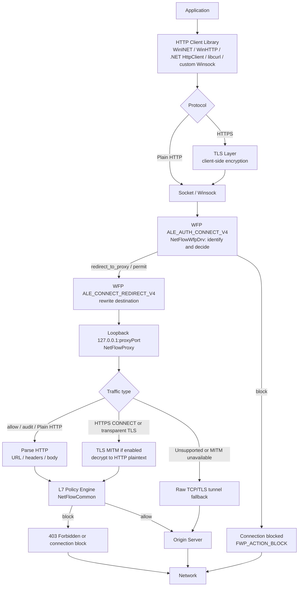

# WFP Driver + Local Proxy + TLS MITM 기반 통신 분석 및 제어 연구과제

## 1. 개요

본 문서는 Windows 환경에서 애플리케이션 네트워크 통신을 식별하고, 필요 시 Local Proxy로 유도한 뒤, HTTP 또는 TLS MITM으로 복호화된 HTTPS 평문을 분석하여 정책 기반으로 허용/차단하는 연구과제를 정리한 기술 문서이다. 현재 구현된 코드 기준의 구조, 구현 결과, 제어 방식, 제어 가능 범위와 제약사항을 함께 설명한다.

본 연구 구조의 핵심은 다음과 같다.

| 구분 | 설명 |
|------|------|
| 커널 계층 | WFP driver가 프로세스, 원격 주소, 포트, 프로토콜 기반으로 1차 정책을 평가한다. |
| 리다이렉트 | 검사 대상 TCP 연결을 loopback Local Proxy로 유도하고, 원래 목적지 정보를 redirect context로 전달한다. |
| 사용자 계층 | Local Proxy가 HTTP/HTTPS 데이터를 파싱하고 L7 정책을 평가한다. |
| HTTPS 분석 | TLS MITM이 성공한 경우에만 URL path, header, body, JSON 필드 수준의 제어가 가능하다. |
| 관측 | Proxy와 Viewer는 세션, payload, decision 이벤트를 통해 제어 결과를 확인할 수 있게 한다. |

## 2. 연구/개발 배경

Windows에서 애플리케이션 통신을 제어하는 방식은 크게 endpoint metadata 기반 제어와 payload 기반 제어로 나눌 수 있다. WFP(Windows Filtering Platform)는 Windows 네트워크 스택에 필터와 callout을 등록하여 네트워크 흐름을 허용, 차단, 감사 또는 리다이렉트할 수 있는 플랫폼이다.

다만 WFP의 ALE(Application Layer Enforcement) 계층은 HTTP URL, Header, Body 같은 L7 데이터를 직접 제공하지 않는다. ALE 계층은 주로 `connect`, `bind`, `listen`, `accept`, flow 생성 같은 socket operation 시점에 프로세스, 사용자, 프로토콜, 원격 주소, 원격 포트 정보를 기준으로 정책을 적용하는 위치이다.

따라서 URL, Header, Body, Content-Type, JSON 필드 기준의 세밀한 제어를 수행하려면 다음 구조가 필요하다.

1. WFP driver가 검사 대상 연결을 식별한다.
2. 필요 시 연결 목적지를 Local Proxy로 리다이렉트한다.
3. Local Proxy가 원래 목적지 정보를 복원한다.
4. HTTP는 평문으로 파싱한다.
5. HTTPS는 가능한 경우 TLS MITM으로 복호화한다.
6. 복호화된 HTTP 평문을 기준으로 L7 정책을 평가한다.

이 구조는 WFP의 빠른 연결 단위 제어와 Proxy의 L7 분석 기능을 조합한다는 점에서 장점이 있다. 반면 TLS 신뢰, certificate pinning, HTTP/2, QUIC/HTTP3, 대용량 streaming 처리 등은 별도 한계와 운영 정책을 필요로 한다.

## 3. 목표

본 연구/개발의 목표는 Windows 환경에서 구현 가능한 통신 제어 구조를 검증하고, 현재 코드가 제공하는 기능과 아직 보완이 필요한 영역을 명확히 구분하는 것이다.

### 3.1 기능 목표

| 목표 | 현재 상태 | 설명 |
|------|-----------|------|
| 프로세스 기반 연결 식별 | 구현 | WFP metadata와 ALE app id를 사용하여 PID와 app path를 식별한다. |
| L3/L4 정책 제어 | 구현 | `processRules`, `networkRules` 기반 allow/block/audit/redirect 결정을 수행한다. |
| Transparent Proxy 유도 | 구현 | `ALE_CONNECT_REDIRECT_V4/V6` 에서 loopback proxy port로 목적지를 변경한다. |
| Redirect context 복원 | 구현 | Proxy가 `SIO_QUERY_WFP_CONNECTION_REDIRECT_CONTEXT` 로 원래 목적지와 process metadata를 조회한다. |
| HTTP L7 제어 | 구현 | URL, request/response header, body, JSON 필드 조건을 평가한다. |
| HTTPS MITM 제어 | 부분구현 | Root CA 신뢰와 MITM 성공 조건에서 HTTP 평문 기준 제어가 가능하다. |
| Viewer 기반 관측 | 구현 | named pipe 기반 session event를 Viewer UI에 표시한다. |

### 3.2 검토 목표

- 현재 가능한 제어와 불가능한 제어를 구분한다.
- 구현 완료된 항목과 향후 개선 항목을 분리한다.
- 정책 파일 구조와 실제 parser가 지원하는 필드를 기준으로 문서화한다.

---

## 4. 기본 개념 설명

### 4.1 WFP

WFP는 Windows Filtering Platform의 약자로, Windows 네트워크 스택에서 packet, transport, stream, ALE 등 여러 계층에 필터를 등록할 수 있는 네트워크 필터링 프레임워크이다.

본 구현은 주로 ALE 계층을 사용한다. ALE는 패킷이 NIC 직전에서 흐르는 위치라기보다, 애플리케이션이 socket API를 통해 연결을 만들거나 수락하는 시점에 정책을 적용하는 위치에 가깝다.

```
Application
  -> Winsock / Socket API
  -> WFP ALE layer
  -> Transport / Network stack
  -> Network
```

### 4.2 ALE

ALE는 Application Layer Enforcement의 약자이다. 이름에 Application이 포함되지만 HTTP 같은 L7 application payload를 의미하는 것은 아니다. WFP에서 말하는 application은 주로 연결을 생성한 프로세스, 사용자, app id 같은 endpoint identity를 뜻한다.

| ALE layer | 용도 |
|-----------|------|
| `ALE_AUTH_CONNECT` | outbound connect 허용/차단 결정 |
| `ALE_CONNECT_REDIRECT` | outbound connect 목적지 리다이렉트 |
| `ALE_AUTH_RECV_ACCEPT` | inbound accept 또는 non-TCP 첫 패킷 제어 |
| `ALE_FLOW_ESTABLISHED` | flow 성립 이후 알림 |

현재 driver는 `ALE_AUTH_CONNECT_V4/V6` 와 `ALE_CONNECT_REDIRECT_V4/V6` 를 등록한다.

### 4.3 Local Proxy와 Transparent Redirect

Local Proxy는 같은 장비의 loopback 주소에서 동작하는 사용자 모드 프록시이다. 본 구현에서 Proxy는 `127.0.0.1:<proxyPort>` 와 `[::1]:<proxyPort>` 에서 listen하며, WFP redirect로 들어온 연결을 accepted socket으로 수신한다.

Transparent redirect는 애플리케이션이 명시적으로 Proxy 설정을 하지 않아도 WFP가 연결 목적지를 loopback proxy로 바꾸는 방식이다.

```
Application -> example.com:443
WFP redirect
Application -> 127.0.0.1:proxyPort
```

애플리케이션은 원 서버로 직접 연결한다고 생각하지만, 실제 TCP 연결은 Local Proxy로 들어온다. Proxy는 redirect context를 통해 원래 목적지와 process metadata를 복원한 뒤 upstream server로 별도 연결을 만든다.

Local Proxy는 다음 역할을 수행한다.

- WFP redirect context 조회
- 원래 원격 IP/port 및 process metadata 복원
- HTTP request/response 파싱
- HTTPS CONNECT 또는 transparent TLS 처리
- TLS MITM 또는 raw tunnel fallback
- L7 정책 평가 및 Viewer event 발행

### 4.4 Fiddler 프록시 방식과 Callout Driver + Local Proxy 방식의 차이

Fiddler 같은 일반적인 HTTP debugging proxy는 주로 명시적 프록시 방식으로 동작한다. 애플리케이션 또는 Windows 시스템 proxy 설정이 `127.0.0.1:<fiddlerPort>` 를 가리키면, HTTP client library가 처음부터 Proxy로 요청을 보낸다.

```
Application
  -> HTTP client library
  -> Explicit/System Proxy 설정
  -> Fiddler
  -> Origin Server
```

이 방식은 HTTP client가 proxy 설정을 따르는 경우에는 단순하고 관측성이 좋다. 반면 proxy 설정을 무시하는 custom Winsock 앱, 자체 네트워크 stack을 사용하는 앱, 별도 trust store나 pinning 정책을 가진 앱은 Fiddler 경로에 들어오지 않을 수 있다.

NetFlow의 Callout Driver + Local Proxy 방식은 애플리케이션의 proxy 설정에 의존하지 않는다. WFP callout driver가 `connect()` 경로에서 연결 metadata를 보고, 정책상 검사 대상인 TCP 연결의 목적지를 loopback Local Proxy로 바꾼다.

```
Application
  -> Winsock connect
  -> WFP callout driver
  -> Transparent redirect
  -> NetFlowProxy
  -> Origin Server
```

두 방식의 차이는 다음과 같이 정리할 수 있다.

| 구분 | Fiddler 방식 | Callout Driver + Local Proxy 방식 |
|------|--------------|-------------------------------------|
| 진입 방식 | 명시적 proxy 또는 시스템 proxy 설정 | WFP redirect 기반 transparent 처리 |
| 애플리케이션 인식 | 앱이 proxy로 요청한다고 인식 | 앱은 원 서버로 연결한다고 인식 |
| 제어 기준 | HTTP client가 전달한 proxy 요청 | 프로세스, 원격 IP/port, protocol, redirect context |
| 적용 범위 | proxy 설정을 따르는 앱 중심 | Winsock connect 경로의 TCP 연결 중심 |
| HTTPS 처리 | Root CA 신뢰 기반 MITM | Root CA 신뢰 기반 MITM + WFP metadata 연계 |
| 한계 | proxy 미사용 앱은 우회 가능 | TLS pinning, QUIC/HTTP3, raw TCP payload 해석 한계 |

따라서 Fiddler는 개발자 관점의 HTTP debugging proxy에 가깝고, NetFlow 구조는 endpoint 통신 제어를 위해 kernel metadata와 user-mode L7 proxy를 결합한 구조에 가깝다.

### 4.5 TLS MITM

TLS MITM은 Man-In-The-Middle 방식으로 HTTPS 통신을 두 개의 독립 TLS 세션으로 나누어 처리하는 구조이다. Client와 Server 사이에 하나의 TLS 세션이 그대로 이어지는 것이 아니라, Local Proxy를 기준으로 Client-Proxy 구간과 Proxy-Server 구간이 분리된다.

```
일반 HTTPS:
Client -> TLS -> Server

TLS MITM:
Client -> TLS session 1 -> Local Proxy -> TLS session 2 -> Server
```

구간별로 보면 다음과 같다.

```
[Client]
  |
  | TLS Session 1
  | Server 인증서처럼 보이는 "Proxy가 만든 leaf 인증서" 사용
  v
[Local Proxy]
  |
  | TLS Session 2
  | 실제 서버가 제공한 "진짜 leaf 인증서" 사용
  v
[Server]
```

Proxy는 클라이언트 입장에서는 서버처럼 동작하고, 원 서버 입장에서는 클라이언트처럼 동작한다. MITM이 성공하면 Proxy 내부에서는 TLS Session 1을 복호화해 HTTP 요청/응답을 확인하고, 정책 판단 후 TLS Session 2로 다시 암호화하여 서버와 통신한다.

```
Client request over TLS Session 1
        |
        v
[복호화]
GET /path HTTP/2
Host: example.com
Cookie: ...
Content-Type: ...
        |
        v
[정책 판단]
허용 / 차단 / 로깅 / 수정
        |
        v
[재암호화]
        |
        v
Forward over TLS Session 2
```

이 방식이 성공하면 Proxy는 HTTP method, URL path, header, body, response header, response body를 확인할 수 있다.

### 4.6 TLS MITM에서 Root CA가 필요한 이유

TLS MITM에서 CA 인증서는 보통 Local Proxy가 자체적으로 생성한 Root CA 인증서이다. 이 Root CA는 TLS 세션에서 Client에게 직접 제시되는 leaf 인증서가 아니라, Proxy가 동적으로 만든 host별 leaf 인증서를 신뢰시키기 위한 상위 인증서이다.

```
Proxy Root CA
 |- chatgpt.com용 leaf 인증서
 |- api.openai.com용 leaf 인증서
 `- www.google.com용 leaf 인증서
```

클라이언트는 HTTPS 접속 시 서버 인증서를 검증한다. 예를 들어 `https://example.com` 에 접속했는데 중간 Proxy가 임의로 만든 인증서를 제시하면, 클라이언트는 기본적으로 그 인증서를 신뢰하지 않는다.

```
example.com 접속
   ↓
Proxy가 example.com용 인증서 생성
   ↓
Client가 인증서 발급자를 확인
   ↓
발급자를 신뢰하지 않으면 차단
```

그래서 TLS MITM Proxy는 보통 자체 Root CA를 생성하고, 그 Root CA를 클라이언트의 신뢰 저장소에 등록한다. 대표적인 trust store는 다음과 같다.

- Windows CurrentUser Root
- Windows LocalMachine Root
- Firefox/NSS DB
- Java `cacerts`
- Electron/Chromium 별도 저장소
- 애플리케이션 자체 trust store

```
Proxy Root CA
  ↓ 서명
example.com용 Leaf Certificate
```

클라이언트가 Proxy Root CA를 신뢰하면, Proxy가 동적으로 생성한 사이트별 leaf 인증서도 신뢰할 수 있다.

```
Client Trust Store
 └── Proxy Root CA 신뢰

Proxy Root CA
 └── example.com 인증서 발급

Client: 정상 인증서로 판단
```

따라서 TLS MITM은 단순히 암호문을 읽는 구조가 아니라, 클라이언트가 신뢰할 수 있는 인증서 체인을 Proxy가 구성해야 하는 구조이다.

구간별 인증서 적용은 다음과 같다.

| 구간 | TLS 역할 | 사용되는 leaf 인증서 | 발급자 | 검증 주체 |
|------|----------|----------------------|--------|-----------|
| Client -> Local Proxy | Proxy가 서버 역할 | Proxy가 생성한 대상 host용 leaf 인증서 | Proxy Root CA | Client |
| Local Proxy -> Server | 실제 서버가 서버 역할 | 실제 서버의 leaf 인증서 | 공인 CA | Local Proxy |

Client가 보는 인증서 체인은 다음과 같다.

```
example.com leaf 인증서
 `── issued by Proxy Root CA
      `── Client trust store에 등록되어 있음
```

Client가 Proxy Root CA를 신뢰하지 않으면 다음과 같은 오류가 발생할 수 있다.

- `NET::ERR_CERT_AUTHORITY_INVALID`
- `SEC_E_UNTRUSTED_ROOT`
- `certificate verify failed`

현재 구현은 다음 기능을 포함한다.

- Root CA 로드/생성
- Root 저장소 등록
- host/SNI별 leaf certificate 생성

### 4.7 Certificate Pinning

Certificate Pinning은 애플리케이션이 서버 인증서 또는 공개키를 고정해서 검증하는 방식이다. Client가 단순히 Root CA 신뢰 여부만 확인하는 경우에는 MITM이 가능하지만, 앱이 자체적으로 leaf fingerprint, public key pin, issuer, certificate chain 값을 검사하면 MITM이 실패할 수 있다.

예를 들어 앱이 `chatgpt.com` 의 leaf public key hash는 특정 값이어야 한다고 고정해두면, Proxy Root CA로 서명된 leaf 인증서는 OS trust store에서 신뢰되더라도 앱 내부 pinning 검증을 통과하지 못한다.

```
원래:
chatgpt.com leaf
  Issuer = 공인 CA

MITM:
chatgpt.com leaf
  Issuer = Proxy Root CA
```

이 경우 증상은 보통 다음과 같다.

- TLS handshake 실패
- connection reset
- `certificate verify failed`
- `pinning validation failed`
- 앱 내부 오류

Pinning 환경에서는 실패 세션을 기록하고, 앱/host별 MITM bypass, metadata 기반 허용/차단, fail-close 정책 같은 운영 방식을 검토해야 한다.

---

## 5. 전체 구조

전체 구조는 Kernel level의 WFP driver와 User level의 Agent, Proxy, Viewer로 구성된다. 외부에는 원 서버와 네트워크가 존재한다.

### 5.1 전체 흐름도



**텍스트로 풀어보면 다음과 같은 흐름이다.**

1. Application이 HTTP Client Library(WinINET / WinHTTP / .NET HttpClient / libcurl / custom Winsock)를 통해 통신을 시작한다.
2. Plain HTTP면 바로 Socket/Winsock으로, HTTPS면 TLS Layer(client-side encryption)를 거쳐 Socket/Winsock으로 간다.
3. `WFP ALE_AUTH_CONNECT_V4` 단계에서 NetFlowWfpDrv가 연결을 식별하고 판단한다.
   - `block` → 연결 차단 (`FWP_ACTION_BLOCK`)
   - `redirect_to_proxy` / `permit` → `WFP ALE_CONNECT_REDIRECT_V4` 에서 목적지를 재작성하여 loopback `127.0.0.1:proxyPort` (NetFlowProxy)로 보낸다.
4. NetFlowProxy는 트래픽 종류에 따라 처리한다.
   - Plain HTTP (allow/audit) → HTTP 파싱 (URL/headers/body)
   - HTTPS CONNECT 또는 transparent TLS → TLS MITM이 활성화되어 있으면 복호화하여 HTTP 평문으로 변환
   - 지원되지 않거나 MITM이 불가능한 경우 → Raw TCP/TLS tunnel fallback
5. 파싱되거나 복호화된 데이터는 L7 Policy Engine(NetFlowCommon)에서 평가된다.
   - `block` → 403 Forbidden 또는 connection block
   - `allow` → Origin Server로 전달
6. Raw tunnel fallback은 정책 평가 없이 바로 Origin Server로 전달된다.
7. 모든 경로의 최종 트래픽은 Network로 나간다.

```
User level
  Application
    -> Winsock connect

  NetFlowAgent.exe
    -> rules.json 로드
    -> IOCTL_NETFLOW_SET_POLICY
    -> IOCTL_NETFLOW_SET_RUNTIME_CONFIG
    -> NetFlowProxy.exe 시작 및 감시

  NetFlowProxy.exe
    -> 127.0.0.1:proxyPort listen
    -> [::1]:proxyPort listen
    -> redirect context 조회
    -> HTTP / HTTPS / MITM / raw tunnel 처리
    -> L7 정책 평가
    -> Viewer event 발행

  NetFlowViewer.exe
    -> named pipe event 수신
    -> session, payload, decision 표시

Kernel level
  NetFlowWfpDrv.sys
    -> WFP provider / sublayer / callout / filter 등록
    -> ALE_AUTH_CONNECT_V4/V6 정책 평가
    -> ALE_CONNECT_REDIRECT_V4/V6 loopback redirect
    -> NF_REDIRECT_CONTEXT 연결

External
  Network
    -> Origin Server
```

### 5.2 모듈 구성

| 모듈 | 실행 영역 | 주요 역할 |
|------|-----------|-----------|
| `NetFlowWfpDrv.sys` | Kernel | WFP callout/filter 등록, 연결 정책 평가, loopback redirect, redirect context 설정 |
| `NetFlowAgent.exe` | User | 정책 파일 로드, driver IOCTL 전달, runtime config 적용, Proxy process 관리 |
| `NetFlowProxy.exe` | User | loopback listener, HTTP/TLS 처리, L7 정책 평가, Viewer event 발행 |
| `NetFlowViewer.exe` | User | Proxy가 발행한 세션 이벤트를 UI로 표시 |
| `NetFlowCommon` | Library | 공통 정책 구조, JSON 정책 parser, L7 정책 평가기 |

### 5.3 데이터 흐름 요약

1. 애플리케이션이 원격 서버로 `connect()` 를 호출한다.
2. WFP driver가 `ALE_AUTH_CONNECT` 에서 정책을 평가한다.
3. 차단 대상이면 driver가 연결을 차단한다.
4. 검사 대상이면 `ALE_CONNECT_REDIRECT` 에서 목적지를 loopback proxy port로 변경한다.
5. Proxy가 accepted socket에서 redirect context를 조회한다.
6. Proxy가 원래 목적지를 복원하고 upstream server로 연결한다.
7. HTTP 또는 MITM 평문을 기준으로 L7 정책을 평가한다.
8. 허용 시 데이터를 중계하고, 차단 시 `403 Forbidden` 또는 연결 종료를 수행한다.

---

## 6. 현재 구현된 결과

현재 구현은 WFP driver, Agent, Proxy, Viewer가 분리된 구조로 동작한다. 주요 구현 결과는 다음과 같다.

| 영역 | 구현 내용 | 실제 의미 |
|------|-----------|-----------|
| WFP driver | `ALE_AUTH_CONNECT_V4/V6`, `ALE_CONNECT_REDIRECT_V4/V6` callout/filter 등록 | 프로세스와 원격 endpoint 기준으로 연결을 허용, 차단, 감사, redirect할 수 있다. |
| Redirect context | `NF_REDIRECT_CONTEXT` 생성 및 IPv4/IPv6 원래 목적지 저장 | Proxy가 loopback으로 들어온 연결의 실제 upstream 주소와 process metadata를 복원할 수 있다. |
| Agent | `rules.json` 로드, driver IOCTL 전달, runtime config 적용 | 정책과 Agent/Proxy PID, proxy port를 driver에 전달하여 redirect와 loop 방지 조건을 맞춘다. |
| Proxy | IPv4/IPv6 loopback listener, HTTP parsing, HTTPS CONNECT/transparent TLS 처리 | WFP redirect 또는 직접 proxy 접속을 받아 L7 정책 평가와 upstream 중계를 수행한다. |
| TLS MITM | Root CA 로드/자동 생성, CurrentUser Root 등록, leaf certificate cache, client/upstream TLS handshake | TLS MITM이 가능한 HTTPS 연결은 복호화된 HTTP request/response 기준으로 제어할 수 있다. |
| Viewer | named pipe session event 수신 및 표시 | request/response header와 body, decision, process metadata를 UI에서 확인할 수 있다. |

---

## 7. 제어 방식

### 7.1 WFP 정책

WFP 정책은 연결 생성 시점의 metadata를 기준으로 동작한다.

```json
{
    "defaultAction": "allow",
    "proxyListenPort": 18080,
    "viewerCaptureAll": true,
    "processRules": [],
    "networkRules": []
}
```

| 필드 | 설명 |
|------|------|
| `defaultAction` | 명시적 rule이 없을 때의 기본 action |
| `proxyListenPort` | redirect 대상 Local Proxy port |
| `viewerCaptureAll` | TCP traffic capture용 redirect rule 자동 추가 여부 |
| `processRules` | app path 기반 process 정책 |
| `networkRules` | protocol, remote IP, remote port, host/SNI 후보 기반 network 정책 |

지원 action은 `allow`, `block`, `audit`, `redirect_to_proxy` 이다.

`processRules` 는 실행 파일 경로를 기준으로 프로세스 단위 정책을 적용한다. 실제 JSON 필드는 `exePath` 이며, driver는 현재 프로세스의 app path와 대소문자 무시 비교 또는 suffix match를 수행한다. `exePath` 가 비어 있거나 `*`, `all`, `<all>`, `any` 이면 전체 프로세스 대상으로 동작한다.

```json
{
  "processRules": [
    {
      "description": "curl traffic through proxy",
      "enabled": true,
      "priority": 10,
      "exePath": "curl.exe",
      "action": "redirect_to_proxy"
    },
    {
      "description": "block a specific executable",
      "enabled": true,
      "priority": 20,
      "exePath": "C:\\BlockedApp\\blocked.exe",
      "action": "block"
    }
  ]
}
```

`networkRules` 는 프로세스 조건과 원격 endpoint 조건을 함께 사용한다. 현재 driver의 실제 평가 기준은 `exePath`, `protocol`, `remotePort`, `remoteIp`, `action`, `priority`, `enabled` 이다. `host` 와 `sni` 는 Agent가 IPv4 DNS 확장을 수행해 `remoteIp` 를 채운 뒤 driver에 전달하는 일반 적용 경로에서 유효하다. `urlPrefix` 는 parser와 redirect context 필드에는 있으나, `ALE_AUTH_CONNECT` 단계에서 URL 판단 조건으로 직접 사용되지는 않는다.

```json
{
  "networkRules": [
    {
      "description": "redirect HTTPS traffic for httpbin",
      "enabled": true,
      "priority": 10,
      "exePath": "*",
      "protocol": "tcp",
      "remotePort": 443,
      "host": "httpbin.org",
      "action": "redirect_to_proxy"
    },
    {
      "description": "block QUIC or UDP 443",
      "enabled": true,
      "priority": 20,
      "exePath": "*",
      "protocol": "udp",
      "remotePort": 443,
      "action": "block"
    },
    {
      "description": "block a fixed IPv4 destination",
      "enabled": true,
      "priority": 30,
      "exePath": "*",
      "protocol": "tcp",
      "remoteIp": "93.184.216.34",
      "remotePort": 80,
      "action": "block"
    }
  ]
}
```

여러 rule이 match되면 더 높은 `priority` 값을 가진 rule이 선택된다.

### 7.2 L7 정책

L7 정책은 top-level `rules` 배열로 정의한다. Proxy가 HTTP 또는 MITM으로 복호화된 HTTPS 평문을 확보한 경우에만 평가된다.

```json
{
  "rules": [
    {
      "name": "Block restricted classification",
      "enabled": true,
      "action": "block",
      "url": {
        "operator": "contains",
        "value": "https://httpbin.org/post"
      },
      "requestJson": [
        {
          "path": "classification",
          "operator": "equals",
          "value": "restricted"
        }
      ]
    }
  ]
}
```

| 조건 | 설명 |
|------|------|
| `url` | URL 문자열 조건 |
| `requestHeaders` | request header 조건 |
| `responseHeaders` | response header 조건 |
| `requestBody` | request body 문자열 조건 |
| `responseBody` | response body 문자열 조건 |
| `requestJson` | request JSON dot path 조건 |
| `responseJson` | response JSON dot path 조건 |

지원 operator는 `equals`, `contains`, `regex` 이다. JSON path는 `classification` 또는 `user.role` 같은 dot path 형식이다.

### 7.3 Request 단계 제어

Request 단계 제어는 upstream server로 데이터를 보내기 전에 수행된다.

1. Proxy가 request URL, header, body를 확보한다.
2. L7 request 규칙을 평가한다.
3. block rule이 match되면 `403 Forbidden` 을 반환하거나 TLS over MITM 경로에서 차단 응답을 전송한다.
4. allow인 경우 upstream server로 request를 전달한다.

### 7.4 Response 단계 제어

Response 단계 제어는 upstream server 응답을 받은 뒤 client로 전달하기 전에 수행된다.

1. Proxy가 response header와 body 일부를 읽는다.
2. L7 response 규칙을 평가한다.
3. block rule이 match되면 원 응답 대신 `403 Forbidden` 을 반환한다.
4. allow인 경우 원 응답을 client로 전달한다.

---

## 8. 제어 범위와 제약사항

### 8.1 TLS 신뢰와 MITM 의존성

HTTPS L7 제어는 TLS MITM 성공에 종속된다. Root CA가 신뢰되지 않거나, 앱이 별도 trust store를 사용하거나, certificate pinning을 적용하면 MITM은 실패할 수 있다.

### 8.2 Certificate Pinning

현재 구현은 pinning 우회를 제공하지 않는다. Pinning 앱에서는 TLS handshake 실패, bypass cache hit, raw tunnel fallback 또는 연결 종료가 발생할 수 있다. 운영 정책으로 앱/host별 MITM bypass 또는 metadata 기반 차단을 선택해야 한다.

### 8.3 QUIC/HTTP3

> ⚠️ 갱신(2026-07-13): 아래는 WFP 제품 그림 기준 서술. **현재 PoC 방향에서는 QUIC/HTTP3도 범위 안**(C-1 차단→TCP 폴백 우선, C-2 실제 복호화는 본격 확장). 기준 문서: `scope-and-protocol-coverage.md`.

QUIC/HTTP3는 UDP 기반이며 TCP TLS MITM 경로와 다르다. 현재 driver에는 UDP redirect 정책의 QUIC 우회 방지를 위한 block 경로가 포함되어 있으나, QUIC payload를 MITM 방식으로 복호화하는 구조는 아니다.

### 8.4 HTTP/2, streaming, 대용량 body

HTTP/2 direct 감지와 일부 fallback은 포함되어 있으나, multiplexing stream을 완전하게 분해하여 L7 정책을 적용하는 수준은 추가 검토가 필요하다. 대용량 body와 streaming response는 메모리 사용량, 지연, 부분 검사 정책을 별도로 설계해야 한다.

---

## 9. 결론

현재 NetFlow 구현은 Windows 환경에서 WFP driver와 Local Proxy를 결합하여 연결 metadata 기반 제어와 L7 기반 제어를 함께 수행하는 구조이다. Driver는 `ALE_AUTH_CONNECT_V4/V6` 와 `ALE_CONNECT_REDIRECT_V4/V6` 에서 연결을 식별하고, 필요한 TCP 연결을 loopback Proxy로 유도한다. Proxy는 redirect context를 조회하여 원래 목적지와 process metadata를 복원하고, HTTP 또는 MITM에 성공한 HTTPS 평문을 기준으로 정책을 평가한다.

이 구조는 URL, Header, Body, JSON 필드 기반 제어를 사용자 모드 Proxy에서 처리하고, WFP driver는 연결 metadata 기반의 빠른 1차 제어를 담당한다는 점에서 역할이 명확하다. 또한 Viewer와 로그를 통해 세션과 정책 판단 결과를 확인할 수 있어 개발 및 검증 단계에서 관측 가능성이 확보되어 있다.

다만 HTTPS 제어는 Root CA 신뢰와 TLS MITM 성공 여부에 의존한다. Certificate pinning, 별도 trust store, QUIC/HTTP3, HTTP/2 multiplexing, streaming, 대용량 body는 현재 구조에서 제한이 있거나 추가 검토가 필요한 영역이다.

따라서 본 연구 결과는 다음과 같이 판단할 수 있다.

- TCP 기반 HTTP/HTTPS 트래픽은 WFP redirect와 Local Proxy를 통해 제어 경로로 유도할 수 있다.
- HTTP 및 MITM 성공 HTTPS는 L7 정책으로 세밀하게 제어할 수 있다.
- WFP driver는 L3/L4 metadata 기반의 빠른 1차 제어에 적합하다.
- Pinning, QUIC/HTTP3, 대용량 streaming은 별도 검증과 설계가 필요하다.