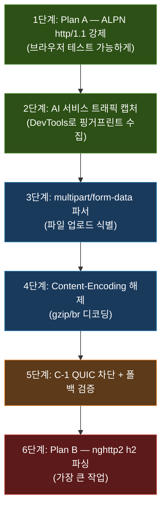

# 로컬 프록시 업그레이드 — 연구 영역 정리

> **현재 위치:** M4/M5 완료 (TLS MITM + 동적 인증서) → **다음 목표: M6~M9 (업로드 식별/추출/분석)**
> **전제:** WFP 커널 연동은 나중. 지금은 명시적 프록시(`curl -x` / 브라우저 설정) 기준으로 로컬 프록시가 할 수 있는 걸 다 한다.

---

## 본 과제의 진짜 목표

> **여러 AI 솔루션(ChatGPT/Gemini/네이버 등)이 각자 다른 프로토콜로 올리는
> "파일 업로드"를 식별하고, 파일 정보·바이너리를 추출·분석하는 것.**

**핵심 포인트:**
- 제어 대상은 **AI 솔루션**. 서비스마다 프로토콜이 다르다.
- **파일 업로드 식별이 제일 관건이고, 쉽지 않다. 100%는 불가능**(변조/pinning/암호화 등).
- 그래서 **전 단계(통신 구조)를 잘 아는 게 중요.**

→ 결론: **연구 과제.** "완벽 탐지"가 아니라, 서비스별로
**"잡을 수 있다 / 이론상 못 잡는다"의 경계선을 긋고**,
가능한 범위에서 파일 메타·바이너리를 뽑아내는 것이 핵심 산출물.

---

### 왜 파일 업로드 식별/추출이 진짜 어려운가

> "프록시 구현은 AI 딸깍으로 틀 나온다. 시간이 많이 걸리는 건 바이너리를 어떻게 해석하는지다."

**어려운 이유**: 서비스마다 파일 업로드 포맷이 제각각이라 공식 문서가 없고,
직접 트래픽을 보면서 역으로 파악해야 한다.

| 서비스 유형 | 업로드 방식 | 파악 난이도 |
|------------|------------|------------|
| 표준 방식 | `multipart/form-data` (RFC 표준) | 낮음 (스펙 있음) |
| JSON 방식 | body에 base64 인코딩해서 전송 | 중간 |
| 자체 방식 | 서비스 전용 바이너리/API | 높음 (문서 없음, 트래픽만 보고 해석) |

**실제로 해야 하는 일:**
1. MITM으로 HTTPS 복호화 → 평문 HTTP body 확보
2. "이 바이트 패턴이 파일 업로드인가?" 를 트래픽 보며 직접 판단
3. "파일 바이너리가 body의 어디서 어디까지인가?" 경계를 코드로 파싱
4. 추출한 바이너리가 원본과 일치하는지 해시로 검증
5. 파일 시그니처(매직넘버)로 실제 파일 타입 확인

**Wireshark vs 우리 프록시:**
- Wireshark: 패킷 구조를 "보기만" 함. HTTPS는 암호화돼서 내용 못 봄.
- 우리 프록시: MITM으로 복호화해서 **평문을 코드로 처리** → 파일 추출까지.

**VS 디버거가 필요해지는 시점:** 바이너리 파싱 단계.
`buffer[i]`에 뭐가 있는지 바이트 단위로 봐야 할 때, `printf`로는 한계가 있고
**VS 메모리 창(hex view) + 중단점** 조합이 압도적으로 편하다.
→ 파싱 고도화/추출 단계부터 VS 디버거 쓸 준비 해두면 좋다.

---

### 주차별 로드맵

```
[W7] 파일 업로드 식별 (multipart/Content-Disposition/파일명/타입/크기)
   ↓
[W8] 파일 메타 + 바이너리 추출 (원본 일치 검증)
   ↓
[W9] 파일 분석(시그니처 등) + 여러 환경 PoC 검증 (성공/실패 정리)
   ↓
[W10] 최종 보고서 + 발표
   ↓
[그 다음 단계 — 로컬 프록시 전부 완성 후] WFP 커널 드라이버 + transparent redirect
   (조건: 로컬이 다 완성된 이후에 진행. 제외가 아니라 '나중에')
```

---

### 현실적 스코프

- 목표 = **완벽 탐지 X**, "어디까지 되고 어디부터 안 되는지" **경계 긋기** (W9).
- **타깃 2~3개 AI 서비스부터** 좁혀서 시작.
- 매 단계 = **동작 코드 + 설명 + 테스트결과/한계** 세트 (W10 보고서로 수렴).
- 트래픽 유도는 **Explicit Proxy** (브라우저 프록시 설정 / `curl -x`) — WFP 없이 진행.

---

## 전체 구조: 3개 층으로 나눠서 생각하기

```
Layer 3 (미래)    │ QUIC/HTTP3 대응
                  │   C-1: UDP:443 차단 → TCP 폴백 유도
                  │   C-2: QUIC 직접 복호화 (대규모)
──────────────────┼─────────────────────────────────────
Layer 2 (핵심)    │ HTTP/2 멀티플렉싱 분해
                  │   Plan A: ALPN 강제 http/1.1 (우회)
                  │   Plan B: nghttp2로 진짜 h2 파싱
──────────────────┼─────────────────────────────────────
Layer 1 (기반)    │ HTTP/1.1 파싱 고도화 + AI 서비스 분석
                  │   multipart/form-data, gzip, chunked
                  │   ChatGPT/Claude/Gemini 업로드 핑거프린트
```

> [!IMPORTANT]
> **아래에서 위로 올라가는 순서로 연구해야 합니다.** Layer 1이 안 되면 Layer 2를 해도 의미가 없고, Layer 2가 안 되면 실제 브라우저 테스트가 불가능합니다.

---

## Layer 1: HTTP/1.1 파싱 고도화 + AI 서비스 분석 (최우선)

### 1-A. multipart/form-data 파싱 (파일 업로드 탐지의 핵심)

**왜 중요한가:**
브라우저에서 파일을 업로드하면 대부분 `multipart/form-data`로 보낸다. 이게 파일 업로드와 일반 텍스트 전송을 구분하는 **가장 기본적인 식별 포인트**.

**연구할 것:**
- `Content-Type: multipart/form-data; boundary=----WebKitFormBoundary...` 구조 이해
- boundary 문자열로 각 part를 분리하는 방법
- 각 part의 `Content-Disposition` 헤더에서 `filename` 필드 추출
- 파일의 MIME type과 매직 넘버(첫 N바이트)로 파일 종류 식별
- 실제 파싱 예시:

```http
POST /upload HTTP/1.1
Content-Type: multipart/form-data; boundary=----WebKitFormBoundaryABC123

------WebKitFormBoundaryABC123
Content-Disposition: form-data; name="text"

안녕하세요
------WebKitFormBoundaryABC123
Content-Disposition: form-data; name="file"; filename="기밀문서.pdf"
Content-Type: application/pdf

%PDF-1.4 ...  ← 여기가 실제 파일 바이너리
------WebKitFormBoundaryABC123--
```

**산출물:** boundary 파싱 → filename 추출 → 파일 종류 판별까지의 코드 또는 의사코드

---

### 1-B. Content-Encoding 디코딩

**왜 중요한가:**
서버 응답뿐 아니라 요청도 압축될 수 있다. 압축된 채로는 body를 읽을 수 없으니, 프록시에서 해제해야 한다.

**연구할 것:**
| 인코딩 | 라이브러리 | 비고 |
|--------|-----------|------|
| `gzip` | zlib | 가장 흔함 |
| `deflate` | zlib | 레거시 |
| `br` (Brotli) | brotli 라이브러리 | 최신 브라우저 기본값 |

- 프록시가 `Accept-Encoding` 헤더를 조작해서 서버가 압축 안 보내게 할 수 있는지?
- 아니면 프록시가 직접 압축 해제 후 파싱하는 게 나은지?

---

### 1-C. chunked Transfer-Encoding 재조립

**왜 중요한가:**
`Content-Length`가 없는 대신 `Transfer-Encoding: chunked`로 오는 응답이 많다. 특히 AI 서비스의 스트리밍 응답(SSE)이 이 형식.

**연구할 것:**
- chunk 크기(hex) + `\r\n` + chunk 데이터 + `\r\n` 구조 파싱
- 마지막 `0\r\n\r\n` 감지
- 전체 재조립 vs 스트리밍 중 부분 검사 (큰 파일은 전체 버퍼링 불가)

---

### 1-D. ⭐ AI 서비스별 업로드 트래픽 분석 (M6의 핵심)

**왜 중요한가:**
이게 실제로 책임님 팀에 **가장 직접적으로 도움이 되는 연구**. 각 AI 서비스가 파일 업로드를 어떤 방식으로 처리하는지 "핑거프린트 테이블"을 만드는 것.

**연구 방법:**
1. 브라우저 DevTools (Network 탭) 열기
2. 각 서비스에 파일 업로드
3. 요청의 URL, Method, Content-Type, 헤더, Body 구조를 기록

**조사 대상 서비스 및 예상 패턴:**

| 서비스 | 경로 | 프로토콜 | 업로드 방식 (예상) | 비고 |
|--------|------|----------|-------------------|------|
| **ChatGPT 웹** | chat.openai.com | h2 / h3 | `multipart/form-data` 또는 전용 API | DevTools로 확인 필요 |
| **ChatGPT 앱** | Windows 데스크톱 | 자체 HTTP client | 브라우저와 다를 수 있음 | Fiddler로 확인 |
| **Claude 웹** | claude.ai | **h3 (QUIC) 확인됨** | `multipart/form-data` 예상 | QUIC 차단 후 TCP 폴백 테스트 필요 |
| **Claude 앱** | Windows 데스크톱 (Electron) | h2 예상 | 웹과 유사할 수 있음 | |
| **Gemini 웹** | gemini.google.com | h2 / h3 | Google 방식 (resumable upload?) | Google은 독자 프로토콜 가능성 |
| **네이버 AI** | clova.ai 등 | h2 | 미확인 | |

**산출물 예시 (핑거프린트 테이블):**
```
[ChatGPT 웹 - 파일 업로드]
URL:          POST https://chatgpt.com/backend-api/files
Protocol:     h2
Content-Type: multipart/form-data; boundary=...
Headers:      Authorization: Bearer ..., X-Request-Id: ...
Body 구조:    part1: {"purpose":"assistants"}, part2: 파일 바이너리
식별 키:      URL path "/backend-api/files" + Content-Type multipart
```

> [!TIP]
> 이 테이블이 완성되면 **"이 URL 패턴 + 이 Content-Type이면 파일 업로드다"** 라는 정책 룰을 자동으로 만들 수 있게 됩니다. 이게 `main_purpose.md` 7.2절 L7 정책의 실전 적용이 됩니다.

---

### 1-E. ⭐ 업로드 식별 목표 — "이 요청이 파일 업로드인지, 어떤 파일인지 판별"

**최종 목표:**
프록시를 통과하는 요청을 보고 다음을 판단할 수 있어야 한다:
- **파일 업로드인가?** (일반 텍스트 채팅 vs 파일 첨부)
- **어떤 파일인가?** (이름 / MIME 타입 / 크기)

**문제: 서비스마다 업로드 방식이 다르다**

| 방식 | 설명 | 사용 서비스 (예상) | 식별 방법 |
|------|------|--------------------|-----------|
| **multipart/form-data** | 전통적인 HTML form 파일 업로드. boundary로 part 구분, `filename` 필드에 파일명 노출 | ChatGPT 웹, 일부 서비스 | `Content-Type` 헤더 + boundary 파싱 + `Content-Disposition: filename=` 추출 |
| **JSON + base64** | 파일을 base64로 인코딩해서 JSON 필드 안에 넣어 보냄. `{"file": "SGVsbG8=", "name": "doc.pdf"}` 형태 | 일부 API, 모바일 앱 | JSON 파싱 → 특정 필드가 base64 패턴인지 검사 (정규식 `/^[A-Za-z0-9+/]+=*$/`) |
| **resumable upload** | 대용량 파일을 여러 청크로 나눠서 보냄. 첫 요청에서 upload URL을 받고, 이후 PUT으로 chunk 전송 | Google (Gemini, Drive) | 초기 POST에서 `X-Upload-Content-Type` 헤더 감지 → 이후 PUT 요청 추적 |
| **전용 바이너리 API** | 서비스 고유의 바이너리/protobuf 포맷 | 데스크톱 앱, gRPC 기반 | Content-Type이 `application/grpc` 또는 `application/octet-stream` → 내부 구조 파악 어려움 |

**식별의 현실적 한계:**

> [!WARNING]
> - **정규식/휴리스틱의 한계:** 서비스가 API를 바꾸면 기존 패턴이 깨진다. 완벽한 탐지가 아니라 **"현재 시점에서의 식별 가능 범위"**를 명확히 긋는 것이 목표.
> - **암호화된 전용 포맷:** 일부 앱은 TLS 안에서 추가 암호화/직렬화를 하므로, MITM 복호화 후에도 body 해석이 불가능할 수 있다.
> - **false positive:** base64처럼 보이지만 실제로는 파일이 아닌 경우, multipart지만 파일이 아닌 form 데이터인 경우 등.

**산출물 — 타깃 2~3개 서비스의 업로드 지문(fingerprint) 표:**

```
┌─────────────────────────────────────────────────────────────┐
│ 서비스: ChatGPT 웹                                          │
├─────────────┬───────────────────────────────────────────────┤
│ 업로드 URL  │ POST https://chatgpt.com/backend-api/files   │
│ Protocol    │ h2 (QUIC 차단 시)                             │
│ 업로드 방식 │ multipart/form-data                           │
│ 파일명 위치 │ Content-Disposition: filename="..."            │
│ 파일타입    │ Content-Type part 헤더 + 매직넘버              │
│ 파일크기    │ Content-Length 또는 part 크기 계산              │
│ 식별 룰     │ URL contains "/backend-api/files"             │
│             │ AND Content-Type starts "multipart/form-data" │
│ 한계        │ API 경로 변경 시 룰 업데이트 필요               │
├─────────────┴───────────────────────────────────────────────┤
│ 서비스: Gemini 웹                                           │
├─────────────┬───────────────────────────────────────────────┤
│ 업로드 URL  │ (DevTools 캡처 후 기록)                        │
│ Protocol    │ h2 / h3                                       │
│ 업로드 방식 │ resumable upload (예상)                        │
│ 파일명 위치 │ (캡처 후 확인)                                  │
│ 식별 룰     │ (캡처 후 정의)                                  │
│ 한계        │ Google 전용 프로토콜 사용 가능성                 │
├─────────────┴───────────────────────────────────────────────┤
│ 서비스: Claude 웹                                           │
├─────────────┬───────────────────────────────────────────────┤
│ 업로드 URL  │ (DevTools 캡처 후 기록)                        │
│ Protocol    │ h3 (QUIC) → 차단 시 h2 폴백                   │
│ 업로드 방식 │ multipart/form-data (예상)                     │
│ 식별 룰     │ (캡처 후 정의)                                  │
│ 한계        │ QUIC 미차단 시 프록시 우회                      │
└─────────────┴───────────────────────────────────────────────┘
```

> [!IMPORTANT]
> **이 지문 표를 실측 데이터로 채우는 것이 M6의 핵심 산출물입니다.** 예상값이 아니라 실제 DevTools/Fiddler 캡처 기반으로 작성해야 합니다.

---

### 1-F. 파일 바이너리 추출 + 원본 일치 검증

**왜 중요한가:**
"파일 업로드를 탐지했다"만으로는 부족하다. 실제로 업로드된 **파일 바이너리를 추출해서 저장**하고, 원본과 동일한지 검증할 수 있어야 한다. 이게 되면 "어떤 파일이 유출됐는가"에 대한 증거를 확보할 수 있다.

**연구할 것:**

1. **multipart body에서 파일 part 경계 분리**
   - boundary 마커 사이의 바이너리 데이터를 정확히 잘라내기
   - 헤더(`Content-Disposition`, `Content-Type`)와 실제 바이너리 본문의 경계 (`\r\n\r\n` 이후)
   - part가 여러 개일 때 파일 part만 골라내기

2. **추출한 바이너리를 파일로 저장**
   - 프록시가 추출한 데이터를 임시 디렉토리에 원본 파일명으로 저장
   - 저장 경로/네이밍 규칙 설계

3. **해시 비교로 원본 일치 검증**
   - 원본 파일의 SHA-256 해시 vs 추출된 파일의 SHA-256 해시
   - 바이트 단위 일치 확인
   - **완료 기준: 추출 파일이 원본과 해시 100% 일치**

4. **대용량 파일 처리 트레이드오프**
   - 전체 버퍼링: 메모리에 전부 올림 → 간단하지만 대용량 시 OOM 위험
   - 스트리밍 추출: 읽으면서 바로 디스크에 쓰기 → 메모리 효율적이지만 구현 복잡
   - 부분 추출 정책: "첫 N바이트만 추출"로 시그니처 확인용 한정 추출

```
[프록시 내부 흐름]

multipart body 수신
  → boundary로 part 분리
  → Content-Disposition에서 filename 추출
  → \r\n\r\n 이후 바이너리 본문 시작
  → 파일로 저장 (streaming write)
  → SHA-256 해시 계산
  → 원본 해시와 비교 → 일치 여부 기록
```

---

### 1-G. 매직넘버(시그니처) 분석 + 확장자 위조 탐지

**왜 중요한가:**
악의적인 사용자가 `malware.exe`를 `report.pdf`로 이름만 바꿔서 업로드할 수 있다. 파일명/확장자만 믿으면 안 되고, **파일 바이너리의 처음 몇 바이트(매직넘버)**를 검사해서 실제 파일 타입을 판별해야 한다.

**연구할 것:**

1. **주요 파일 포맷 매직넘버 테이블**

| 파일 타입 | 매직넘버 (hex) | 오프셋 | 비고 |
|-----------|---------------|--------|------|
| PDF | `25 50 44 46` (`%PDF`) | 0 | |
| PNG | `89 50 4E 47 0D 0A 1A 0A` | 0 | |
| JPEG | `FF D8 FF` | 0 | |
| ZIP/DOCX/XLSX | `50 4B 03 04` (`PK..`) | 0 | Office 문서도 ZIP 컨테이너 |
| EXE/DLL (PE) | `4D 5A` (`MZ`) | 0 | |
| GIF | `47 49 46 38` (`GIF8`) | 0 | |
| MP4 | `66 74 79 70` (`ftyp`) | 4 | 오프셋 주의 |

2. **확장자 vs 실제 타입 불일치 탐지**
   - `filename="document.pdf"` 인데 매직넘버가 `MZ` (EXE) → **위조 경고**
   - `filename="image.png"` 인데 매직넘버가 `PK` (ZIP) → **위조 경고**
   - 판단 로직: `확장자로 추정한 타입 ≠ 매직넘버로 판별한 타입` → alert

3. **시그니처 DB 설계**
   - 매직넘버 → 파일 타입 매핑 테이블 (확장 가능하게)
   - false positive 관리: 일부 포맷은 매직넘버가 겹치거나 없음
   - 시그니처가 없는 파일(plain text, CSV 등)은 확장자+MIME에 의존

> [!TIP]
> 첫 4~8바이트만 읽으면 되므로, 대용량 파일도 매직넘버 검사는 매우 빠르다. 1-F의 "부분 추출(첫 N바이트)" 정책과 자연스럽게 연결된다.

---

### 1-H. 다환경 테스트 + 성공/실패 결과표

**왜 중요한가:**
같은 서비스라도 **브라우저, 데스크톱 앱, 모바일 앱**에 따라 업로드 방식이 다를 수 있다. "어디서는 식별 되고 어디서는 안 되는가"의 **경계(boundary)**를 명확히 정리하는 것이 연구의 핵심 산출물.

**테스트 매트릭스:**

| 서비스 | 경로 | 브라우저/앱 | 파일 업로드 식별 | 파일명 추출 | 바이너리 추출 | 위조 탐지 | 실패 원인 |
|--------|------|-------------|:---:|:---:|:---:|:---:|-----------|
| ChatGPT | 웹 | Chrome | ? | ? | ? | ? | |
| ChatGPT | 웹 | Edge | ? | ? | ? | ? | |
| ChatGPT | 웹 | Firefox | ? | ? | ? | ? | |
| ChatGPT | 데스크톱 앱 | Windows | ? | ? | ? | ? | cert pinning? |
| Claude | 웹 | Chrome | ? | ? | ? | ? | QUIC 차단 필요? |
| Claude | 데스크톱 앱 | Windows | ? | ? | ? | ? | |
| Gemini | 웹 | Chrome | ? | ? | ? | ? | resumable? |

**각 셀에 채울 값:** ✅ 성공 / ❌ 실패 / ⚠️ 부분 성공 / N/A

**실패 시 반드시 기록할 것:**
- 실패 원인 분류: `cert pinning` / `QUIC 우회` / `h2-only` / `전용 바이너리 포맷` / `base64 인코딩` / `기타`
- 이 분류가 곧 **"현재 구조의 한계"**가 되고, `main_purpose.md` 섹션 8에 추가할 내용이 됨

> [!IMPORTANT]
> **이 결과표가 최종 연구의 핵심 산출물입니다.** "완벽한 탐지"가 목표가 아니라, **"무엇이 되고 무엇이 안 되는가"의 경계를 명확히 긋는 것**이 목표입니다.

---

## Layer 2: HTTP/2 멀티플렉싱 분해 (동윤님 말씀대로 6~7할)

### 왜 이게 필요한가

현재 프록시는 HTTP/1.1 텍스트만 파싱 가능. 하지만 **Chrome/Edge는 HTTPS 접속 시 기본적으로 HTTP/2를 사용**. TLS MITM으로 복호화해도 나오는 건 HTTP/2 바이너리 프레임 → 기존 파서로 읽을 수 없음.

### Plan A: ALPN 강제 http/1.1 다운그레이드 (단기 해결책)

**원리:**
```
[브라우저] ←TLS Session 1→ [프록시] ←TLS Session 2→ [서버]

Session 1: 프록시가 ALPN 협상에서 "나는 http/1.1만 지원해" 라고 응답
→ 브라우저가 http/1.1로 다운그레이드

Session 2: 프록시가 서버와는 h2로 연결해도 되고 1.1로 해도 됨
```

**연구할 것:**
- OpenSSL의 `SSL_CTX_set_alpn_select_cb()` 사용법
- 클라이언트 쪽 TLS 핸드셰이크에서 ALPN을 `http/1.1`로 고정하는 코드
- **한계:** gRPC 등 h2-only 서비스는 깨짐. 하지만 대부분의 웹 서비스는 1.1 폴백 지원

**이것만 해도:** 실제 브라우저(Chrome/Edge)로 테스트 가능해짐 → Layer 1의 모든 파싱이 바로 적용됨

---

### Plan B: 진짜 HTTP/2 파싱 (핵심 연구 — nghttp2)

**왜 어려운가 — HTTP/2 vs HTTP/1.1 근본 차이:**

```
HTTP/1.1 (텍스트, 순차적):
요청1 보내기 → 응답1 받기 → 요청2 보내기 → 응답2 받기

HTTP/2 (바이너리, 동시다발적):
하나의 TCP 연결 안에서:
  Stream 1: 요청1의 HEADERS 프레임
  Stream 3: 요청2의 HEADERS 프레임
  Stream 1: 요청1의 DATA 프레임 (일부)
  Stream 3: 요청2의 DATA 프레임 (일부)
  Stream 1: 요청1의 DATA 프레임 (나머지)
  ...
```

**연구할 핵심 개념:**

| 개념 | 설명 | 왜 중요 |
|------|------|---------|
| **바이너리 프레이밍** | 9바이트 헤더 + payload. 텍스트가 아님 | 기존 `\r\n` 파서 사용 불가 |
| **HPACK 헤더 압축** | 헤더가 허프만 코딩 + 동적 테이블로 압축됨 | 헤더를 읽으려면 HPACK 디코더 필요 |
| **스트림 멀티플렉싱** | 하나의 연결에 여러 요청/응답이 섞여서 옴 | 스트림 ID별로 분리 재조립 필요 |
| **플로우 컨트롤** | 스트림/연결 단위 윈도우 제어 | 프록시가 중간에서 올바르게 관리해야 함 |

**nghttp2 라이브러리 연구:**
- [nghttp2 공식](https://nghttp2.org/) — C 라이브러리, HTTP/2 프레임 파싱/생성
- 프록시에서 nghttp2를 사용하는 구조:
  ```
  브라우저 ←h2→ [nghttp2 서버 세션 | 프록시 | nghttp2 클라이언트 세션] ←h2→ 서버
  ```
- nghttp2가 프레임을 파싱해주면, 프록시는 **스트림별 HEADERS/DATA를 콜백으로 받아서** 기존 L7 정책 엔진에 넘기면 됨

**현재 코드 변경점 (`scope-and-protocol-coverage.md` 기준):**
- `proxyExchange`의 선형 루프(요청→응답→요청→응답) → **스트림 기반 멀티플렉싱 이벤트 루프**로 전환 필요
- 이것이 가장 큰 구조적 변경이고, 동윤님이 6~7할이라고 느낀 부분

---

## Layer 3: QUIC/HTTP3 대응

### C-1: UDP:443 차단 → TCP 폴백 유도 (필수, 비교적 간단)

**왜 필수인가:**
`scope-and-protocol-coverage.md`에서 2026-07-14 실측 결과, **claude.ai 파일 업로드가 실제로 h3(QUIC)으로 감**. 차단 안 하면 프록시를 우회해버림.

**연구할 것:**
- Windows 방화벽으로 outbound UDP 443 차단하는 방법 (netsh / WFP networkRules)
- 차단 후 브라우저가 실제로 TCP(h2/h1.1)로 폴백하는지 검증
- 폴백 시간(얼마나 빨리 TCP로 전환되는지)
- 각 브라우저(Chrome/Edge/Firefox)별 폴백 동작 차이

**현재 rules.json에 이미 예시 있음:**
```json
{
  "protocol": "udp",
  "remotePort": 443,
  "action": "block"
}
```

### C-2: QUIC 직접 복호화 (장기 과제, 참고만)

규모가 크고 현재 단계에서는 연구 범위 밖. 필요 라이브러리: ngtcp2/quiche/msquic + QPACK + HTTP/3 프레이밍.

---

## 우선순위 정리 및 추천 연구 순서



| 순서 | 작업 | 난이도 | 예상 기간 | 책임님 팀에 주는 가치 |
|------|------|--------|-----------|---------------------|
| 1 | ALPN http/1.1 강제 | ⭐ 낮음 | 1~2일 | 실제 브라우저 테스트 가능해짐 |
| 2 | AI 서비스 트래픽 캡처/분석 | ⭐⭐ 중간 | 3~5일 | **핑거프린트 테이블 = 정책 룰의 원천 데이터** |
| 3 | multipart/form-data 파서 | ⭐⭐ 중간 | 3~5일 | 파일 업로드 식별 가능 |
| 4 | Content-Encoding 해제 | ⭐ 낮음 | 1~2일 | 압축된 body 분석 가능 |
| 5 | QUIC 차단 + 폴백 검증 | ⭐ 낮음 | 1~2일 | claude.ai 등 QUIC 우회 방지 |
| 6 | HTTP/2 nghttp2 파싱 | ⭐⭐⭐ 높음 | 2~3주 | h2 다운그레이드 없이 네이티브 지원 |

> [!WARNING]
> **6번(nghttp2 h2 파싱)은 가장 크고 어려운 작업입니다.** 하지만 1번(ALPN 강제)으로 당장 브라우저 테스트가 가능해지므로, 6번은 나중에 해도 됩니다. 1~5번을 먼저 하면 **h2 없이도 실용적인 업로드 식별 시스템**을 만들 수 있습니다.
